# CMP ↔ Datamailer Integration (Conceptual)

This is the single source of truth for how the course management platform (CMP)
and Datamailer work together to send email. It has two parts:

- **Part 1 — Conceptual / design** (sections 1–9): the mental model, every
  lifecycle event, and — for each — what exists **today** versus where we want
  to go (**target**).
- **Part 2 — API reference** (the appendix): exact endpoints, payloads,
  idempotency rules, callbacks, and failure handling.

Legend used throughout:

- **Today** — implemented and running (sandbox; there is no Datamailer
  production yet).
- **Target** — the ideal state we are designing toward.
- ⚠️ **Gap** — something the Target needs that does not exist yet, often on the
  Datamailer side. All gaps are collected in [Open design questions](#open-design-questions)
  and [Capability gaps](#capability-gaps).

---

## 1. The two systems and who owns what

The single most important rule: **CMP decides *who should* receive an email;
Datamailer decides whether that email *can be delivered*.**

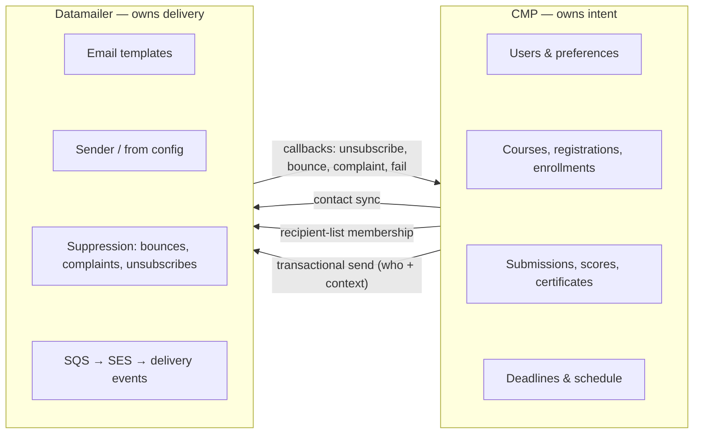

CMP holds the source data (users, enrollments, submissions, scores, deadlines,
preferences). Datamailer holds the delivery machinery (templates, sender config,
hard-bounce/complaint/unsubscribe suppression, queueing, SES, events). CMP never
asks Datamailer "who is subscribed" before a routine send — it computes the
audience itself and lets Datamailer apply its own suppression at delivery time.

**Today:** this split is implemented. **Target:** unchanged — this is the right
boundary and we keep it.

---

## 2. The audience tree (the core mental model)

Datamailer should model a client's audience as a **tree of nested scopes, keyed
by path**. This is **client-agnostic** — CMP is just one client; the same shape
works for any client that has broad and narrow audiences.

- The root `<all>` is the entire client audience.
- Each `:`-separated segment descends one level into a narrower scope.
- **Membership cascades upward.** Adding a person to any node automatically makes
  them a member of every ancestor node, up to `<all>`. So when CMP adds someone
  to `{course-slug}:{homework-slug}`, that person is — by construction — also in
  `{course-slug}` and in `<all>`. CMP never has to maintain the parent levels.

Generic shape, for any client:

```text
<all>
└── {scope}                  e.g. a course
    └── {scope}:{subscope}   e.g. a homework or project within that course
```

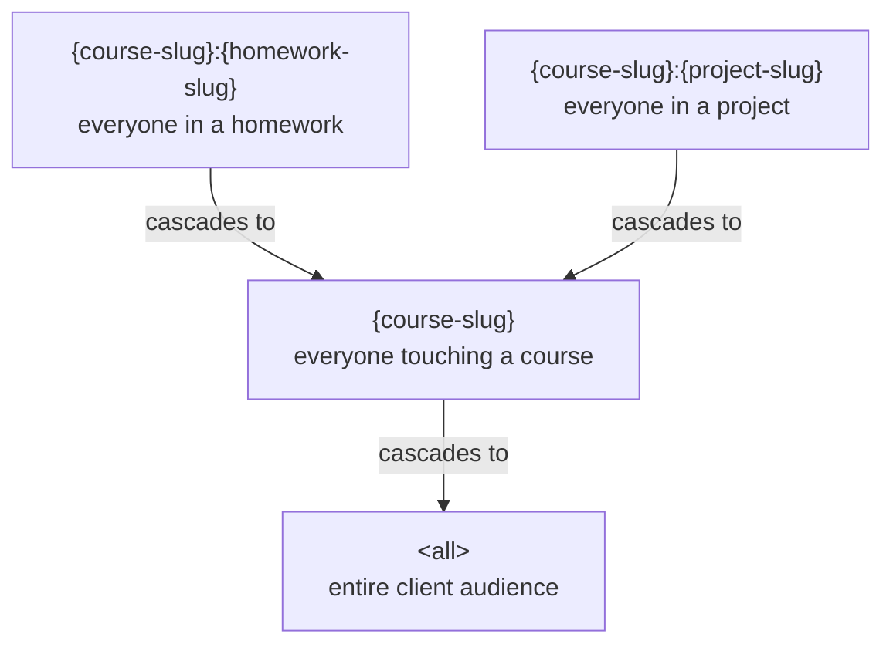

Arrows point **the way membership cascades**: a member of a leaf is automatically
a member of every ancestor. So "everyone who submitted homework 2 of ML Zoomcamp
2026" is just the node `ml-zoomcamp-2026:homework-2`; emailing it is "name the
node." Email `ml-zoomcamp-2026` to reach the whole course; email `<all>` to reach
everyone.

### How CMP maps onto the tree

This generic model has **no CMP-specific vocabulary** (no "registrants",
"enrolled", etc.). Those are CMP's own *roles*, which today CMP encodes as a key
prefix instead of relying on pure scope + cascade:

| Generic tree node | CMP key today | Who is in it |
| --- | --- | --- |
| `<all>` | the audience (`dtc-courses`) | every contact |
| `{course}` | `course-registrants:{course}` | registered for the course |
| `{course}` (active) | `course-enrolled:{course}` | submitted at least once |
| `{course}:{homework}` | `homework-submitters:{course}:{homework}` | submitted that homework |
| `{course}:{project}` | `project-submitters:{course}:{project}` | submitted that project |
| `{course}` (done) — **Target** | `course-graduates:{course}` | completed / certified |

**Today:** CMP writes each membership explicitly with these role-prefixed keys,
and there is **no automatic upward cascade** — CMP (or the backfill command)
maintains every level separately. **Target:** Datamailer provides the generic
cascade, so adding a leaf membership implies the ancestors, and a CMP *role*
(registered / enrolled / submitted / graduated) becomes either a position in the
tree or a status on the membership — not a separate keyspace.

> ⚠️ **Gap (cascade):** upward-cascade membership is a new Datamailer capability.
> Until it exists, CMP must keep writing each ancestor list itself. See gap #8 in
> [§9](#9-capability-gaps-things-to-raise-on-the-datamailer-side).

> Open modeling question: in the pure cascade tree, "registrant" = added at the
> course node, "submitter" = added at an item node (cascades up), and "enrolled"
> (submitted ≥ 1) becomes *derivable* ("has any item-level membership") rather
> than its own list. Whether to keep an explicit `enrolled` distinction is a
> design choice — see [§7](#open-design-questions).

**Two building blocks** compose every flow below:

| Building block | What it represents | Datamailer call |
| --- | --- | --- |
| **Contact** | a person in the audience | `POST /api/contacts` |
| **Recipient-list membership** | a person inside one tree node | `PUT /api/recipient-lists/{key}/members/{source_object_key}` |
| **Transactional send** | an actual email | `POST /api/transactional/send` (one person) or `POST /api/recipient-lists/{key}/transactional-send` (a whole node) |

**Today:** the registrants, enrolled, homework-submitter, and project-submitter
nodes are created and maintained, each written explicitly.
**Target:** add the `course-graduates` / `certificate-eligible` node, adopt
upward cascade so parents are implicit, and fill two gaps in how membership stays
correct (see §5 and §9).

> ⚠️ **Gap:** the protocol reference lists `peer-review-pending:{course}:{project}`
> and `certificate-eligible:{course}` as *recommended* keys, but they are **not
> maintained today**. Peer-review and certificate flows reuse other lists (see
> §4.6 and §4.9).

---

## 3. CMP is the source of truth — why we reconcile at send time

This is the design decision people stumble on, so it gets its own section.

When an operator publishes scores, CMP does **not** trust the slowly-accumulated
list in Datamailer. It **re-queries its own database**, builds the complete set
of eligible recipients, and sends that full snapshot with two flags:

```json
"member_sync": "reconcile",
"remove_absent_members": true
```

Datamailer then makes its list match the snapshot (adding anyone missing,
soft-removing anyone absent) and sends one message per active member.

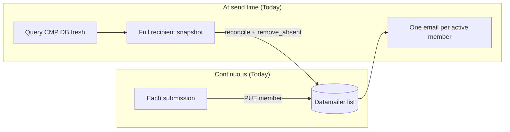

Why both? The continuous push keeps the list *warm* (good for dashboards and
audience-size checks), but it is **delta-based** and therefore fragile — its
correctness depends on every event over months having landed. The
reconcile-at-send is **idempotent and self-correcting**: it re-derives truth from
the database every time, so a missed push, a submission that predates the
integration, or a preference change all get fixed before a single email goes out.

**This is the opposite of fragile** — the snapshot reconcile is what *prevents*
drift. The alternative (let Datamailer's accumulated list be authoritative and
only send deltas) is the classic distributed-sync bug source, and it would break
on the very real gap in §5: CMP-side unsubscribes are not pushed to Datamailer.

**Today:** reconcile-at-send is implemented for all list sends. **Target:** keep
it. Treat the continuous push and the backfill command as *warm-up*, never as the
authority.

---

## 4. Lifecycle, event by event

Each subsection is one event: a diagram, what fires, which preference gates it,
and Today vs Target.

A learner's whole journey:

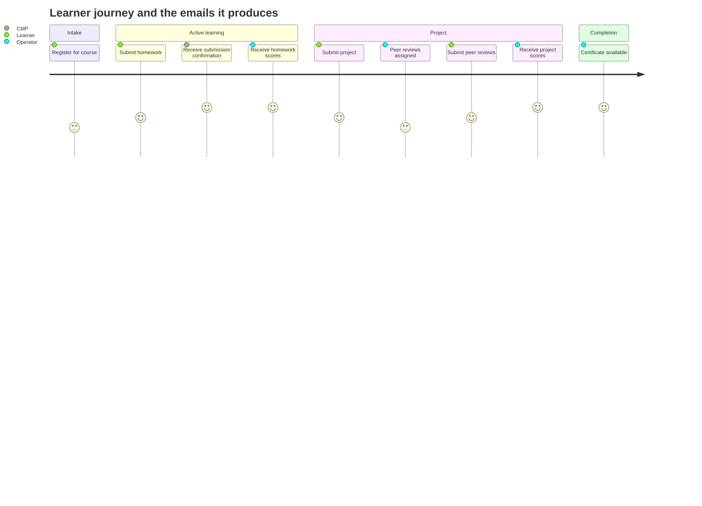

### 4.1 Course registration

A person fills the registration form. This is **interest capture, not email
subscription** — no email is sent.

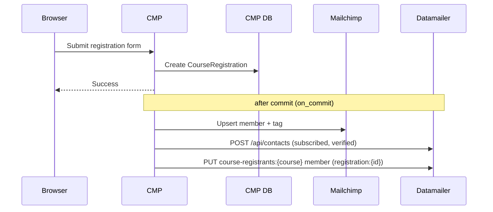

- **Fires:** `sync_registration_to_datamailer` (`course_management/datamailer.py`),
  via `transaction.on_commit` in `courses/views/registration.py`.
- **List:** `course-registrants:{course_slug}` (or `:{campaign_slug}` if no
  course is attached yet).
- **Contact:** upserted as `status: subscribed`, `verified: true`,
  `email_validation: externally_validated` — the form requires newsletter
  consent, so we mark it validated.
- **Preference:** none gates this; it sends no email.
- **Email sent:** none.

**Today:** contact + registrants-list membership, plus a parallel Mailchimp sync.
**Target:** same, with Mailchimp eventually retired once Datamailer is the single
audience store.

### 4.2 Course enrollment

Enrollment is created **implicitly on the first submission** (`get_or_create`),
not by a separate action. A `post_save` signal fires **only on creation**.

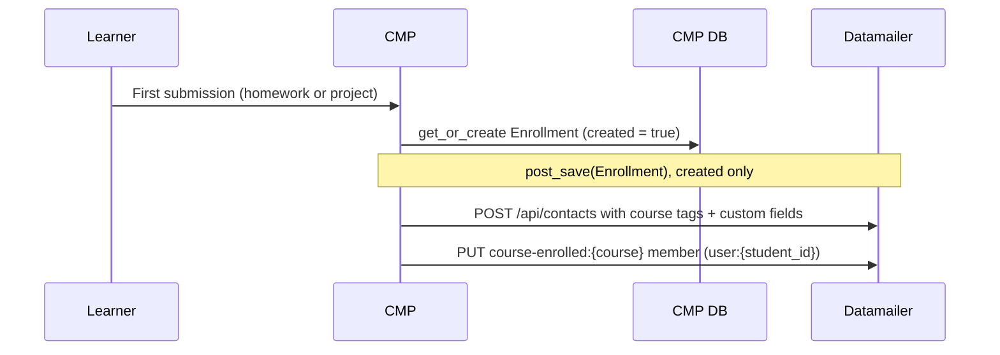

- **Fires:** `sync_enrollment_to_datamailer` from `courses/signals.py`
  (guards `if not created: return`).
- **List:** `course-enrolled:{course_slug}`, member key `user:{student_id}`.
- **Contact:** re-upserted with cohort tags (`course-{family}`,
  `course-cohort-{course}`) and custom fields (course slug/title/family/cohort).
- **Preference:** none; no email.

**Today:** enrolled-list membership + enriched contact, on first submission only.
**Target:** same. ⚠️ Note the *only-on-create* guard means later changes (e.g. a
preference toggle) never re-sync the contact — see §5.

### 4.3 Homework submission (and resubmission)

Two things happen on submit, as two separate calls: a **confirmation email** and
a **list-membership upsert**.

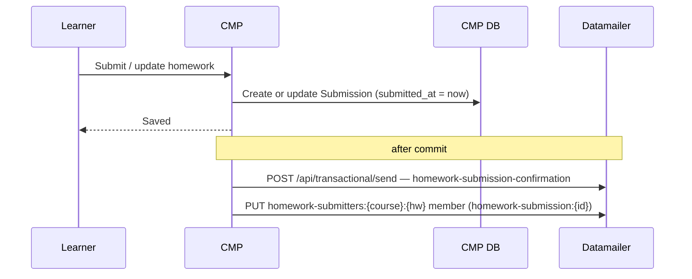

- **Confirmation gated by:** `email_submission_confirmations` (default `True`).
- **List:** `homework-submitters:{course_slug}:{homework_slug}`, member key
  `homework-submission:{submission_id}`.
- **Resubmission:** updating a submission refreshes `submitted_at`, so:
  - the confirmation's idempotency key
    (`homework-submission:{id}:{submitted_at_iso}`) **changes → a new
    confirmation email is sent** for every update;
  - the list member is **upserted in place** (same `source_object_key`, new
    metadata/timestamp/scores).

**Today:** confirmation-on-submit and confirmation-on-update both fire; membership
upserts in place. **Target:** keep — re-sending the confirmation on update is
correct because the learner changed what they submitted (see the
[resubmission design question](#q2-re-sending-after-an-update)).

### 4.4 Homework scoring (operator publishes results)

An operator scores the homework in cadmin. CMP recomputes scores, then sends one
recipient-list transactional send carrying the **full submitter snapshot**.

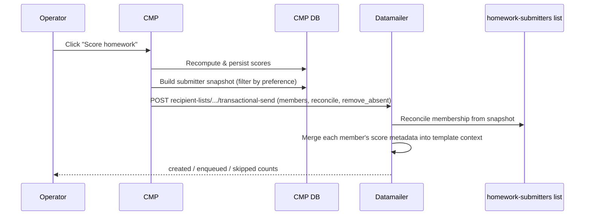

- **Gated by:** `email_submission_confirmations` (per member, at snapshot time).
- **Idempotency:** base key `homework-score:{course}:{homework}`, Datamailer
  appends each member's `source_object_key` → safe to re-run.
- **Audience correctness:** filters that exclude a submitter are exactly: the
  preference is off, the account has no email, or it is a duplicate (only the
  latest submission per student is kept). A submission predating the integration
  is **still included** because the snapshot is a fresh DB query.

**Today:** implemented as described. **Target:** keep.

### 4.5 Project submission

Identical shape to homework submission, on the project list.

- **Confirmation gated by:** `email_submission_confirmations`.
- **List:** `project-submitters:{course_slug}:{project_slug}`, member key
  `project-submission:{submission_id}`.
- **Resubmission:** same semantics as homework (new `submitted_at` → new
  confirmation; member upserted in place).

**Today / Target:** same as homework.

### 4.6 Peer-review assignment (the separate project flow)

Projects have an extra step homework doesn't. After the submission deadline, an
operator **assigns peer reviews**, which moves the project to `PEER_REVIEWING`
and opens a review window. Submitters get a "go review your peers" email.

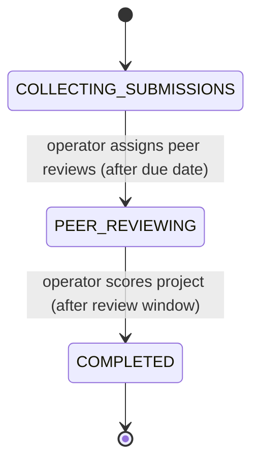

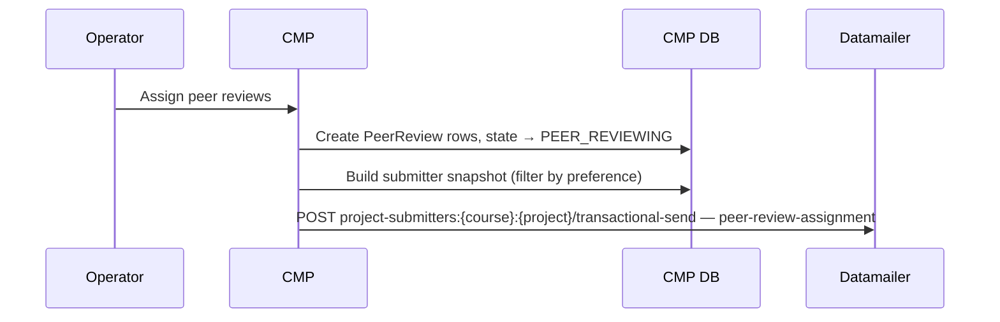

- **Fires:** `send_peer_review_assignment_notification` after
  `assign_peer_reviews_for_project` (cadmin action).
- **List used:** `project-submitters:{course}:{project}` (⚠️ **not**
  `peer-review-pending`, despite that key being recommended).
- **Gated by:** `email_submission_confirmations`.
- **Idempotency:** `peer-review-assignment:{course}:{project}`.

**Today:** uses the project-submitters list, gated by the submission preference.
**Target:** consider a dedicated `peer-review-pending` list scoped to learners who
*still owe* reviews, so reminders target only them rather than all submitters
(⚠️ gap — list not maintained today). Also consider whether "go do your reviews"
should be gated by `email_deadline_reminders` rather than
`email_submission_confirmations` (see [preference granularity](#q3-preference-granularity)).

### 4.7 Peer review submitted (by a learner)

When a learner submits their evaluation of a peer, CMP records it and shows a
thank-you message — **nothing is sent to Datamailer today**. There is no
peer-review-submission confirmation email and no list update.

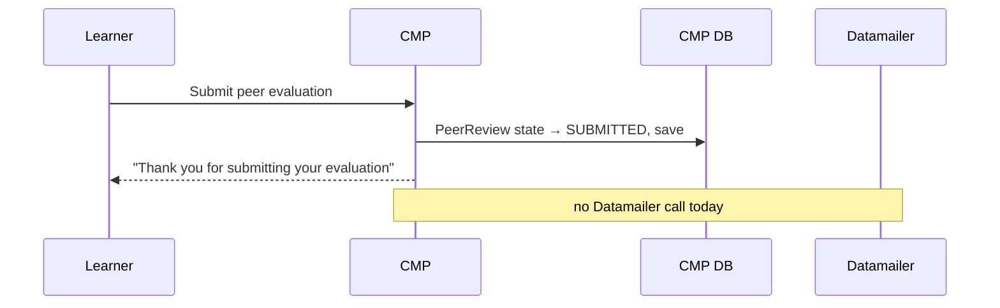

- **Fires:** `project_eval_post_submission` (`courses/views/project.py`) — sets the
  review state to `SUBMITTED` and saves. No email, no Datamailer call.
- **Email sent today:** none.

**Today:** **not** a Datamailer integration point. **Target (candidate):**
(a) optionally send a "your reviews are recorded" confirmation gated by
`email_submission_confirmations`, and/or (b) remove the learner from a
`peer-review-pending` audience once they've finished all assigned non-optional
reviews — which would make the peer-review-due reminder (§4.10) self-clearing.
⚠️ both depend on the `peer-review-pending` list (gap #2) and a new template.

### 4.8 Project scoring

After the review window closes, the operator scores the project. CMP computes
median peer scores, persists them, moves the project to `COMPLETED`, and sends
the score notification — same list, reconcile snapshot.

- **Fires:** `send_project_score_notification` after `score_project`.
- **List:** `project-submitters:{course}:{project}`.
- **Gated by:** `email_submission_confirmations`.
- **Idempotency:** `project-score:{course}:{project}`.

**Today / Target:** same as homework scoring.

### 4.9 Certificate availability

When a certificate URL is published for an enrollment (bulk upload / API), the
learner gets a one-off email. This one is a **direct send**, not a list send.

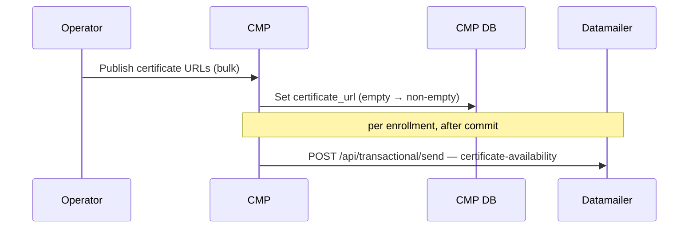

- **Gated by:** `email_course_updates` (default `True`) — it's a course
  operational update, not a submission confirmation.
- **Idempotency:** `certificate-available:{enrollment_id}` (per enrollment).
- **List:** none — direct send to one address.

**Today:** direct send, gated by `email_course_updates`. **Target:** optionally
back it with a `certificate-eligible` / `course-graduates` list so we can also
run graduate campaigns later (⚠️ gap — list not maintained today).

### 4.10 Deadline reminders

CMP owns scheduling because only CMP knows who is enrolled, who has submitted,
and who still owes peer reviews. A scheduled command (`send_deadline_reminders`,
run by EventBridge) recomputes eligibility from current state, reconciles each
reminder's recipient list, and triggers one list send per active reminder event.
All three reminders are gated by `email_deadline_reminders` and **skip anyone who
has already done the thing** the reminder is about.

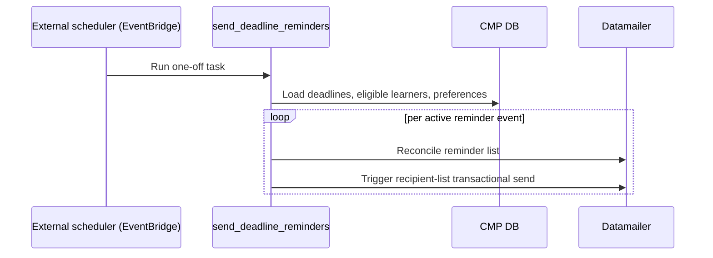

Three reminder types, **all implemented today**:

| Reminder | When | Audience (who gets it) | List key |
| --- | --- | --- | --- |
| **Homework due** | 24h before due | enrolled, **not yet submitted**, pref on | `deadline-reminders:homework:{course}:{hw}:24h` |
| **Project due** | 7d **and** 24h before due | enrolled, **not yet submitted**, pref on | `deadline-reminders:project-submission:{course}:{project}:{7d\|24h}` |
| **Peer review due** | 24h before review deadline | submitted a project **and still has ≥1 unsubmitted, non-optional** assigned review, pref on | `deadline-reminders:peer-review:{course}:{project}:24h` |

Idempotency keys mirror the event (`deadline-reminder:homework:{hw_id}:24h`,
`deadline-reminder:project:{project_id}:{7d|24h}`,
`deadline-reminder:peer-review:{project_id}:24h`) and omit the command timestamp,
so the command can run repeatedly without duplicating.

The **peer-review-due** audience is the tightest and the model for the others: a
learner drops out of it the moment they finish their non-optional reviews —
exactly the self-clearing behavior §4.7 would reinforce.

**Today:** all three implemented; because eligibility is recomputed each run,
moving a deadline just changes the next run (no campaign to update).
**Target:** keep; extend the "tighten audience to who still owes work" pattern.

### 4.11 General course announcements (course starts, module starts) — not built

Broad, non-personalized announcements — "the course starts Monday", "module 3 is
live" — are **not implemented anywhere today**. The `email_course_updates`
preference exists (its help text even mentions course-start announcements), but
no code sends them.

These are **campaign territory, not transactional**: one message to a whole
audience node, not one-per-learner with per-learner context.

- **Audience:** a tree node — `<all>` for a platform-wide notice, `{course-slug}`
  for one course/cohort, optionally `{course-slug}` filtered by module progress.
- **Gated by:** `email_course_updates`.
- **Mechanism (target):** a Datamailer **campaign** with an external key (Part 2 →
  Broad course emails / Campaign API, gap #5), so CMP can create / queue / cancel
  a scheduled announcement and Datamailer snapshots recipients at queue time.

**Today:** absent — any such email is sent by hand from the Datamailer operator
UI. **Target:** CMP-driven campaign API keyed per announcement. ⚠️ depends on the
campaign API (gap #5).

---

## 5. Unsubscribes and the three preferences

CMP has exactly three notification preferences on the user, **all default
`True`**:

| Preference | Gates | Today's default |
| --- | --- | --- |
| `email_submission_confirmations` | homework & project submission confirmations, homework & project **score** notifications, peer-review assignment | `True` |
| `email_deadline_reminders` | deadline reminders | `True` |
| `email_course_updates` | certificate availability, general course updates | `True` |

### Three unsubscribe cases

A learner can opt out of any one of the three categories independently. The send
flows already read these (they filter the snapshot / skip the send), so the
preference is honored on the **next** send after it changes.

### Direction of sync — and the real gap

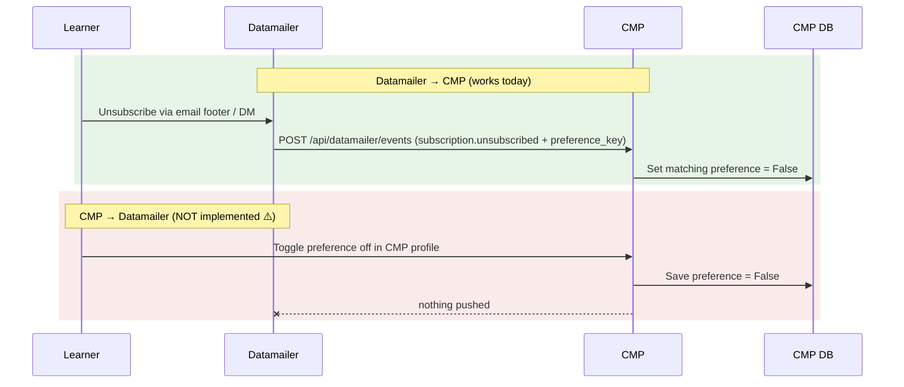

- **Datamailer → CMP works:** an unsubscribe webhook with a recognized
  `preference_key` (one of the three) flips the matching CMP preference to
  `False`. Hard bounces, complaints, transactional skips/failures are stored for
  support. **Resubscribe is stored but does not auto-re-enable** a CMP preference.
- ⚠️ **CMP → Datamailer is the gap.** Toggling a preference in the CMP profile
  saves locally and pushes **nothing** to Datamailer. The contact is only synced
  on *creation* (`if not created: return`). So Datamailer's contact state can be
  stale relative to CMP.

Why this matters for the funnel: reconcile-at-send rereads the CMP preference, so
**CMP-initiated unsubscribes are still honored at score/list-send time** (the
person is dropped from the snapshot). But Datamailer's own contact `subscribed`
flag and any campaign audience built from Datamailer state would be wrong. This
is the concrete reason we cannot let Datamailer's accumulated list be the
authority (see §3).

**Target:** push CMP preference changes to Datamailer on save (drop the
only-on-create guard), so the two stores agree *between* sends, not just at send
time.

---

## 6. Where Current and Target differ — at a glance

| Area | Today | Target |
| --- | --- | --- |
| Audience funnel lists | registrants, enrolled, homework-submitters, project-submitters | + certificate-eligible / graduates; + peer-review-pending |
| Source of truth | CMP DB; reconcile full snapshot at send | unchanged (keep reconcile) |
| Continuous list push | best-effort, delta-based, warm-up only | unchanged (stays warm-up, not authority) |
| Preference sync | Datamailer → CMP only | **bidirectional** (add CMP → Datamailer) ⚠️ |
| Peer-review audience | all project submitters | only those who still owe reviews ⚠️ |
| Certificate audience | direct send, no list | optional list-backed ⚠️ |
| Broad announcements | operator UI campaigns | CMP-driven campaign API with external key ⚠️ |
| Submit confirmation + membership | two separate calls | possibly unified trigger-on-membership (open) |
| Preference granularity | results share `email_submission_confirmations` | possible dedicated results / review prefs (open) |

---

## 7. Open design questions

These are the "think about what makes sense" items. Each is a decision, not yet
a commitment.

### Q1. Trigger-on-membership vs separate send

Today, submitting homework makes **two** calls: send the confirmation email, and
upsert the list member. A campaign-style alternative is "adding a member can
optionally **force a send**" — one call that both records membership and emails.

- **For:** fewer calls; membership and notification can't drift apart.
- **Against:** the two have genuinely different lifecycles. Membership is *funnel
  state* (durable); the confirmation is a *per-event transactional* keyed to
  `submitted_at`. Score/result emails already use the unified pattern
  (list + reconcile + send) and that's correct *because the operator chooses the
  moment*. Auto-sending on every membership add would email people at the wrong
  time (e.g. a backfill or a resubmission shouldn't blast a score email).

**Leaning:** keep submit-time confirmation and membership separate; keep
operator-time results as the unified list-send. Add a *force-send* option to the
membership API only as an explicit, opt-in flag for special cases — never the
default. (⚠️ force-send-on-membership flag does not exist on the Datamailer side
today.)

### Q2. Re-sending after an update

If a learner edits a submission, should they get a fresh email?

- **Submission confirmation:** **yes, today** — `submitted_at` changes, the
  idempotency key changes, a new confirmation goes out. This is correct: the
  content they submitted changed.
- **After scores are published:** today, editing a submission does **not**
  re-trigger a score email (scores are operator-published, idempotent per
  homework). That's the safe default — we don't want edits to silently re-blast
  scores. If we ever want "your updated submission was re-scored" emails, that's
  a deliberate new event with its own key, not a side effect of the edit.

**Leaning:** keep current behavior; make any post-score re-send an explicit
operator action.

### Q3. Preference granularity

Today a single `email_submission_confirmations` gates submission confirmations,
score notifications, **and** peer-review assignment. Those are arguably three
different intents (I confirmed something / here are your results / go do work).

- Splitting into e.g. `email_results_notifications` and treating peer-review
  assignment as a `email_deadline_reminders`-style nudge would give learners
  finer control.
- The contact tags already hint at this (`pref-results-notifications` exists as a
  tag) but there is **no** matching user field.

**Leaning:** worth doing if learners complain about over-emailing; low priority
otherwise. Decide before adding more result-type emails.

---

## 8. Glossary of keys

```text
# Recipient lists (tree nodes — CMP's role-prefixed names; see §2)
course-registrants:{course_slug}
course-enrolled:{course_slug}
homework-submitters:{course_slug}:{homework_slug}
project-submitters:{course_slug}:{project_slug}
peer-review-pending:{course_slug}:{project_slug}      # recommended, not used today ⚠️
certificate-eligible:{course_slug}                    # recommended, not used today ⚠️

# Deadline-reminder lists
deadline-reminders:homework:{course_slug}:{homework_slug}:24h
deadline-reminders:project-submission:{course_slug}:{project_slug}:{7d|24h}
deadline-reminders:peer-review:{course_slug}:{project_slug}:24h

# Member keys (source_object_key)
registration:{registration_id}
user:{student_id}                                     # enrolled list
homework-submission:{submission_id}
project-submission:{submission_id}

# Idempotency keys (events)
homework-submission:{submission_id}:{submitted_at_iso}
project-submission:{submission_id}:{submitted_at_iso}
homework-score:{course_slug}:{homework_slug}
project-score:{course_slug}:{project_slug}
peer-review-assignment:{course_slug}:{project_slug}
certificate-available:{enrollment_id}
deadline-reminder:homework:{homework_id}:24h
deadline-reminder:project:{project_id}:{7d|24h}
deadline-reminder:peer-review:{project_id}:24h
```

---

## 9. Capability gaps (things to raise on the Datamailer side)

Collected from the sections above — what the Target needs that may not exist yet.
Datamailer currently has only a sandbox deployment; none of this implies a
production rollout.

| # | Gap | Needed for | Side |
| --- | --- | --- | --- |
| 1 | **CMP → Datamailer preference push** on profile toggle (drop only-on-create guard) | Stores agree between sends; correct Datamailer campaign audiences | CMP (+ contact update API, exists) |
| 2 | `peer-review-pending` list maintained with only learners who still owe reviews | Targeted review nudges | CMP + Datamailer |
| 3 | `certificate-eligible` / `course-graduates` list | Graduate campaigns; list-backed certs | CMP + Datamailer |
| 4 | **Force-send-on-membership** flag (opt-in) | Q1, special-case unified add+send | Datamailer |
| 5 | Campaign API with external key (`PUT /api/campaigns/{key}`, queue, cancel) | CMP-driven broad announcements | Datamailer |
| 6 | Dedicated result / review preference fields | Q3 finer learner control | CMP |
| 7 | Resubscribe → optionally re-enable CMP preference (today: stored only) | Honor re-opt-in | CMP policy + Datamailer metadata |
| 8 | **Upward-cascade membership** — adding a member to a node implies all ancestor nodes up to `<all>` | Generic audience tree (§2); CMP stops maintaining parent levels by hand | Datamailer |

---

# Part 2 — API reference

The wire-level contract behind Part 1. CMP owns course state and learner
preferences; Datamailer owns templates, sender config, suppression, delivery,
event tracking, and message history.

## Implementation status

The current CMP integration has:

- Datamailer contact sync for new users and enrollments.
- Datamailer homework and project submission confirmation emails.
- Datamailer contact status and history lookups.
- Parallel Datamailer sync for course registrations.
- Datamailer recipient-list member sync for course registrations, course
  enrollments, homework submitters, and project submitters.
- Datamailer recipient-list sends for homework and project score notifications
  and peer-review assignment.
- Datamailer certificate availability emails.
- Datamailer deadline reminder command using recipient-list sends.
- Datamailer callbacks to CMP for hard bounces, complaints, unsubscribes,
  resubscribes, transactional skips, and transactional failures.
- CMP backfill command for Datamailer recipient lists.
- Mailchimp sync for course registrations.

Planned, not implemented yet:

- CMP UI surfacing for stored Datamailer callback events.
- The capability gaps listed in [§9](#9-capability-gaps-things-to-raise-on-the-datamailer-side).

## Configuration

CMP enables Datamailer only when all required settings are present:

```text
DATAMAILER_URL
DATAMAILER_API_KEY
DATAMAILER_CLIENT
DATAMAILER_AUDIENCE
```

CMP may also set:

```text
DATAMAILER_FROM_EMAIL
DATAMAILER_STRICT
DATAMAILER_WEBHOOK_TOKEN
DATAMAILER_SYNC_ON_USER_CREATE
```

`DATAMAILER_FROM_EMAIL` is a Datamailer sender ID, not a raw email address.
Datamailer validates it against the authenticated client sender configuration.

CMP keeps transactional template keys as code-level constants. We don't add one
environment variable per template.

`PUBLIC_BASE_URL` is a CMP URL-building setting, not a Datamailer API setting.
CMP uses it when it builds links for email context.

When `DATAMAILER_STRICT=0`, CMP logs Datamailer failures and lets the course
flow continue. When `DATAMAILER_STRICT=1`, CMP raises the Datamailer API failure
to the caller.

## Contact sync

CMP syncs contacts when it creates users, enrollments, and course registrations
(conceptually §4.1–4.2). During rollout, CMP keeps the existing Mailchimp sync
and also upserts the registrant into Datamailer.

```text
POST /api/contacts
Authorization: Bearer <DATAMAILER_API_KEY>
```

```json
{
  "email": "learner@example.com",
  "audience": "dtc-courses",
  "client": "dtc-courses",
  "status": "subscribed",
  "verified": true,
  "email_validation": {
    "status": "externally_validated"
  },
  "tags": [
    "course-ml-zoomcamp",
    "course-cohort-ml-zoomcamp-2026"
  ]
}
```

CMP sends `status: subscribed`, `verified: true`, and
`email_validation.status: externally_validated` for course-scoped contacts. The
registration form requires newsletter consent, so CMP marks the contact verified
and externally validated. Course-scoped tags include both the family tag and
cohort tag, e.g. `course-ml-zoomcamp` and `course-cohort-ml-zoomcamp-2026`.

## Transactional sends

CMP uses Datamailer transactional email for several learner-specific events.
They call the same endpoints but trigger from different parts of the lifecycle
(see Part 1, §4).

| Trigger | Email | CMP owner | Status |
| --- | --- | --- | --- |
| Learner submits work | homework submission confirmation | homework submit view | implemented |
| Learner submits work | project submission confirmation | project submit view | implemented |
| Operator publishes results | homework score notification | cadmin homework scoring | implemented |
| Operator assigns peer reviews | peer-review assignment | cadmin project action | implemented |
| Operator publishes results | project score notification | cadmin project scoring | implemented |
| Operator publishes certificates | certificate availability | certificate bulk/API flow | implemented |
| Scheduled command runs | deadline reminders | `send_deadline_reminders` | implemented |

Single-recipient sends (submission confirmations, certificates):

```text
POST /api/transactional/send
Authorization: Bearer <DATAMAILER_API_KEY>
```

```json
{
  "email": "learner@example.com",
  "template_key": "homework-submission-confirmation",
  "from_email": "courses",
  "idempotency_key": "homework-submission:123:2026-06-18T10:00:00+00:00",
  "context": {
    "course_slug": "ml-zoomcamp",
    "course_title": "Machine Learning Zoomcamp",
    "homework_slug": "homework-1",
    "homework_title": "Homework 1",
    "update_url": "https://courses.datatalks.club/course/homework/homework-1",
    "profile_url": "https://courses.datatalks.club/accounts/settings/"
  },
  "metadata": {
    "source": "course-management-platform",
    "event": "homework_submission",
    "course_slug": "ml-zoomcamp",
    "homework_slug": "homework-1",
    "submission_id": 123
  }
}
```

List sends (score publication, peer-review assignment, deadline reminders) carry
the current member snapshot in the same request and reconcile before sending
(see Part 1, §3):

```text
POST /api/recipient-lists/{list_key}/transactional-send
Authorization: Bearer <DATAMAILER_API_KEY>
```

```json
{
  "audience": "dtc-courses",
  "client": "dtc-courses",
  "template_key": "homework-score-notification",
  "idempotency_key": "homework-score:ml-zoomcamp-2026:homework-1",
  "member_sync": "reconcile",
  "remove_absent_members": true,
  "context": {
    "course_title": "Machine Learning Zoomcamp",
    "homework_title": "Homework 1",
    "scores_url": "https://courses.datatalks.club/ml-zoomcamp-2026/"
  },
  "list": {
    "type": "homework_submitters",
    "name": "Machine Learning Zoomcamp Homework 1 submitters"
  },
  "members": [
    {
      "source_object_key": "homework-submission:123",
      "email": "learner@example.com",
      "status": "active",
      "metadata": {
        "submission_id": 123,
        "questions_score": 6,
        "learning_in_public_score": 2,
        "faq_score": 1,
        "total_score": 9
      }
    }
  ],
  "metadata": {
    "source": "course-management-platform",
    "event": "homework_score_publication",
    "course_slug": "ml-zoomcamp-2026",
    "homework_slug": "homework-1"
  }
}
```

Datamailer reconciles the list first, then creates one transactional message per
active member, merging each member's metadata into that learner's template
context. CMP remains the source of truth for scores. If the same
`idempotency_key` is sent again for the same client, Datamailer returns the
existing message and does not enqueue another email.

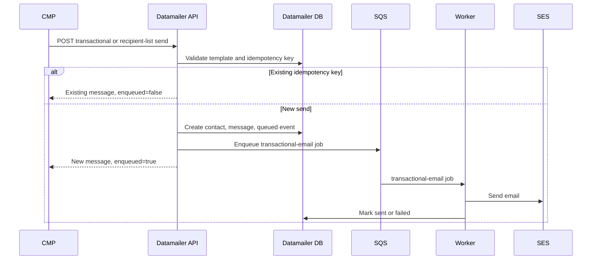

## Recipient lists

Datamailer has native recipient lists rather than using tags as lists. Tags are
audience-scoped and broad; recipient lists have client and audience scope,
membership audit, backfill support, and send-specific counters. List keys do not
need a `cmp:` prefix because the authenticated API client already scopes
ownership. (Key scheme: Part 1, §8.)

Datamailer tables:

```text
recipient_lists
- client, audience, key, type, name, metadata
- member_count, active_member_count, last_reconciled_at
- created_at, updated_at

recipient_list_members
- recipient_list, contact, email, source_object_key, metadata
- active, removed_at, created_at, updated_at
```

Required uniqueness:

```text
(client, audience, key)
(recipient_list, source_object_key)
(recipient_list, contact)
```

CMP maintains registration, enrollment, homework-submitter, and
project-submitter lists after local commits. The first member upsert creates the
parent list if it does not exist, so CMP never checks before adding a member.

```text
PUT  /api/recipient-lists/{key}
PUT  /api/recipient-lists/{key}/members/{source_object_key}
POST /api/recipient-lists/{key}/members/bulk-upsert
POST /api/recipient-lists/{key}/members/reconcile
GET  /api/recipient-lists/{key}
```

Example first homework submit:

```text
PUT /api/recipient-lists/homework-submitters:ml-zoomcamp-2026:homework-1/members/homework-submission:123
```

```json
{
  "audience": "dtc-courses",
  "client": "dtc-courses",
  "list": {
    "type": "homework_submitters",
    "name": "ML Zoomcamp 2026 Homework 1 submitters",
    "metadata": { "course_slug": "ml-zoomcamp-2026", "homework_slug": "homework-1" }
  },
  "member": {
    "email": "learner@example.com",
    "status": "active",
    "metadata": { "submission_id": 123, "user_id": 55, "submitted_at": "2026-06-18T12:00:00Z" }
  }
}
```

The `members/reconcile` endpoint accepts a full CMP snapshot and can soft-remove
members missing from that snapshot. It supports `dry_run` and `remove_absent`.
This is the mechanism behind reconcile-at-send (Part 1, §3).

CMP exposes a backfill command for retroactive list creation — the *warm-up*
tool, never the source of authority:

```console
$ uv run python manage.py sync_datamailer_recipient_lists registrations --course-slug ml-zoomcamp-2026
$ uv run python manage.py sync_datamailer_recipient_lists enrollments --course-slug ml-zoomcamp-2026
$ uv run python manage.py sync_datamailer_recipient_lists homework --course-slug ml-zoomcamp-2026 --homework-slug homework-1
$ uv run python manage.py sync_datamailer_recipient_lists project --course-slug ml-zoomcamp-2026 --project-slug midterm-project
$ uv run python manage.py sync_datamailer_recipient_lists homework --course-slug ml-zoomcamp-2026 --reconcile
$ uv run python manage.py sync_datamailer_recipient_lists registrations --dry-run
```

## Idempotency keys

CMP sends stable idempotency keys for every transactional email. The key
identifies the event, not the command run. (Full list: Part 1, §8.) For
recipient-list sends, CMP sends the base event key and Datamailer appends each
member's `source_object_key` when creating that learner's idempotency key.

Deadline-reminder keys deliberately omit the command timestamp, so the command
can run repeatedly without duplicating. If a moved deadline should allow a second
reminder, CMP can add the deadline timestamp to the key
(`deadline-reminder:homework:{id}:24h:{deadline_iso}`) — a deliberate change,
since it sends a second reminder after each deadline edit.

## Deadline reminders

CMP owns scheduling because Datamailer doesn't know who is enrolled, has
submitted, has unfinished peer reviews, or opted out (conceptually §4.10). The
command:

```console
$ uv run python manage.py send_deadline_reminders
```

For deployed environments, EventBridge runs a one-off ECS task with the CMP
image (command overridden to `python manage.py send_deadline_reminders`),
provisioned via Terraform in `DataTalksClub/infra-terraform` alongside the CMP
ECS service. The rule assumes an invocation role that trusts EventBridge and may
call `ecs:RunTask` for the CMP task definition plus `iam:PassRole`. CMP itself
does not configure the schedule. The command reconciles the current lists,
triggers one list send per reminder event, then exits.

## Broad course emails

Broad announcements should use Datamailer campaigns, not a CMP loop over
transactional sends. CMP syncs contact tags for coarse filtering:

```text
course-{course_slug}
course-cohort-{course_cohort_slug}
pref-submission-confirmations
pref-deadline-reminders
pref-course-updates
pref-results-notifications
```

CMP should not use tags as the canonical source for submitter or registrant
lists — use recipient lists for those. Datamailer currently supports campaign
creation through the operator UI. If CMP needs to create or update scheduled
campaigns directly, we add a campaign API with an external key (gap #5):

```text
PUT  /api/campaigns/{external_key}
POST /api/campaigns/{external_key}/queue
POST /api/campaigns/{external_key}/cancel
```

`PUT` updates only draft or scheduled campaigns and rejects queued/sending/sent
ones. Datamailer snapshots recipients only when the campaign is queued, not when
CMP creates the draft, keeping preference and tag changes current until send
time.

## Status lookups

CMP can read contact status and email history for support and debugging:

```text
GET /api/contacts/status?email=<email>&audience=<audience>&client=<client>
GET /api/contacts/{contact_id}/history?audience=<audience>&client=<client>
GET /api/transactional/messages/{message_id}
```

CMP should not use status lookups to decide routine sends — Datamailer applies
hard-bounce and complaint suppression when CMP calls the send endpoint.

## Callbacks

Datamailer calls CMP for contact events CMP needs to surface or map back to
preferences (conceptually §5):

```text
POST /api/datamailer/events
Authorization: Bearer <DATAMAILER_WEBHOOK_TOKEN>
```

CMP stores each callback in `data_datamailercontactevent` keyed by Datamailer's
stable `event_id`, so repeated callbacks are idempotent. On the Datamailer side
callbacks sit in a `cmp_callbacks` outbox and a dispatcher posts them with retry
and backoff.

Implemented event types:

```text
contact.hard_bounced
contact.complained
subscription.unsubscribed
subscription.resubscribed
transactional.skipped
transactional.failed
```

Hard bounces and complaints are deliverability state; skipped/failed are delivery
audit state — CMP stores them for support. For `subscription.unsubscribed`, CMP
updates a preference only when the callback carries a recognized `preference_key`
(`email_submission_confirmations`, `email_deadline_reminders`,
`email_course_updates`). Resubscribe events are stored but do **not**
auto-re-enable a CMP preference (gap #7).

```json
{
  "event_id": "datamailer-email-event:123",
  "event_type": "subscription.unsubscribed",
  "email": "learner@example.com",
  "occurred_at": "2026-06-18T10:00:00Z",
  "audience": "dtc-courses",
  "client": "dtc-courses",
  "preference_key": "email_course_updates",
  "metadata": { "scope": "client" }
}
```

## Failure handling

CMP makes Datamailer calls after local DB commits, so it never emails for
rolled-back course changes. When Datamailer is unconfigured, CMP skips Datamailer
work. On error: `DATAMAILER_STRICT=0` logs and keeps the learner-facing flow
successful; `DATAMAILER_STRICT=1` raises so tests and strict environments fail
fast. Datamailer returns existing messages for duplicate idempotency keys, so CMP
can safely retry failed HTTP requests with the same key.

List membership maintenance is stricter than best-effort confirmation emails. If
a submit-time list update fails, CMP needs a retry path or the reconciliation
command; the list send path exposes counts and reconciliation state so CMP can
detect drift before it triggers score emails.
