# CMP ↔ Datamailer Integration (Conceptual)

**Purpose of this document: describe the state we want to be in — how the CMP ↔
Datamailer integration *should* work — and what we need to do to get there.**
It is a design document, not a description of the current code. Current behaviour
appears only as the **starting point for migration**: where it already matches the
target, we say so; where it differs, we call out the change as work to do.

It has two parts:

- **Part 1 — Target design** (sections 1–9): the mental model, every lifecycle
  event, the preference model, and the gaps/work to reach the target.
- **Part 2 — API reference** (the appendix): the endpoints and payloads the target
  uses, annotated with what the current code already does.

Legend used throughout:

- **Target** — how it should work; the thing we are building toward. This is the
  default voice of the document.
- **Today** — what the current code does, called out only to mark the delta we
  need to close (sandbox only; there is no Datamailer production yet).
- ⚠️ **Gap / work to do** — something the target needs that does not exist yet.
  Build work is collected in [§9 Capability gaps](#9-capability-gaps-things-to-raise-on-the-datamailer-side);
  softer questions in [§7 Open design questions](#7-open-design-questions); and
  unresolved holes in the design itself in [§10 Unresolved design gaps](#10-unresolved-design-gaps).

---

## 1. The two systems and who owns what

The single most important rule: **CMP decides *who should* receive an email;
Datamailer decides whether that email *can be delivered*.**

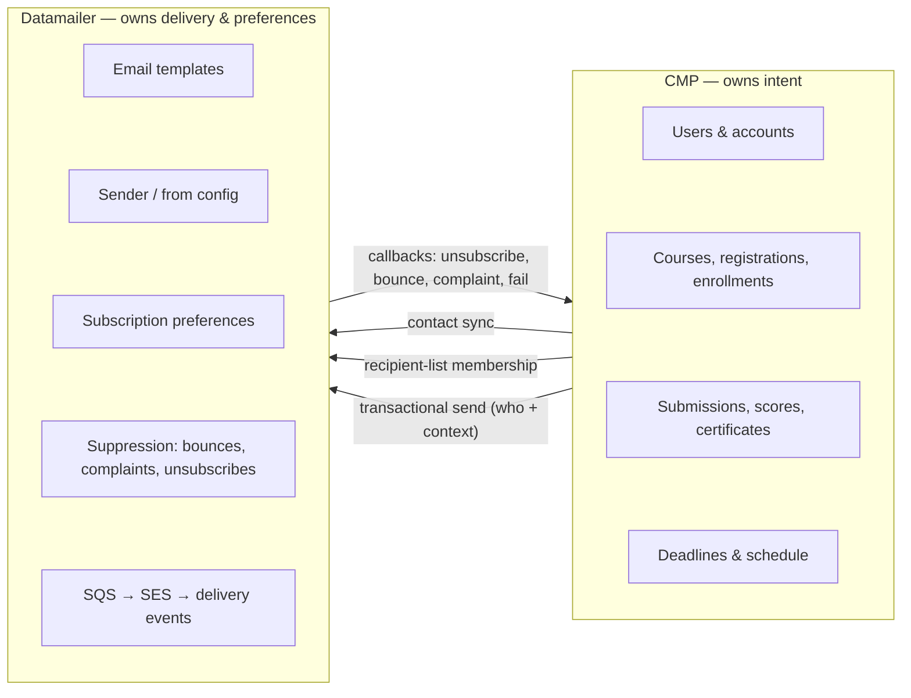

CMP holds the source data (users, enrollments, submissions, scores, deadlines).
Datamailer holds the delivery machinery **and the learner's email preferences**
(templates, sender config, subscription preferences, hard-bounce/complaint/
unsubscribe suppression, queueing, SES, events). Preferences live in Datamailer so
there is only one store to keep correct (§5).

In the target, CMP **keeps Datamailer's audience tree current by emitting events**
(§2–§3): a learner joins or leaves a node, a preference flips, an unsubscribe
arrives. A send then just **names a node** — Datamailer already knows who is in
it. CMP does not compute or attach a recipient list per send. Datamailer still
applies its own deliverability suppression (bounces, complaints) at delivery time.

This ownership split already holds today; the part we need to build is making the
event stream **complete and reliable** enough that Datamailer's list can be
trusted without a per-send reconcile (§3).

---

## 2. The audience tree (the core mental model)

Datamailer should model a client's audience as a **tree of nested scopes, keyed
by path**. This is **client-agnostic** — CMP is just one client; the same shape
works for any client that has broad and narrow audiences.

- The root `<all>` is the entire client audience.
- Each `:`-separated segment descends one level into a narrower scope.
- **Membership cascades upward.** Adding a person to any node automatically makes
  them a member of every ancestor node, up to `<all>`. So when CMP adds someone
  to `{course-slug}:e:{homework-slug}`, that person is — by construction — also in
  `{course-slug}:e`, `{course-slug}` and in `<all>`. CMP never maintains parents.

Generic shape, for any client:

```text
<all>
└── {scope}                                  e.g. a course
    ├── {scope}:{subscope}                   e.g. a homework or project
    │   └── {scope}:{subscope}:{outcome}     e.g. passed that project
    └── {scope}:{outcome}                    a course-level outcome, e.g. graduated
```

A client may also insert **intermediate grouping nodes**. CMP uses one — a reserved
synthetic segment `e` (*enrolled*) — to separate **registered** from **enrolled**:

```text
<all>
└── {course}                          registered
    └── {course}:e                    enrolled (submitted ≥ 1 thing)
        ├── {course}:e:{homework}     submitted a homework
        ├── {course}:e:{project}      submitted a project
        │   └── {course}:e:{project}:passed   passed the project
        └── {course}:e:graduated      graduated / certified
```

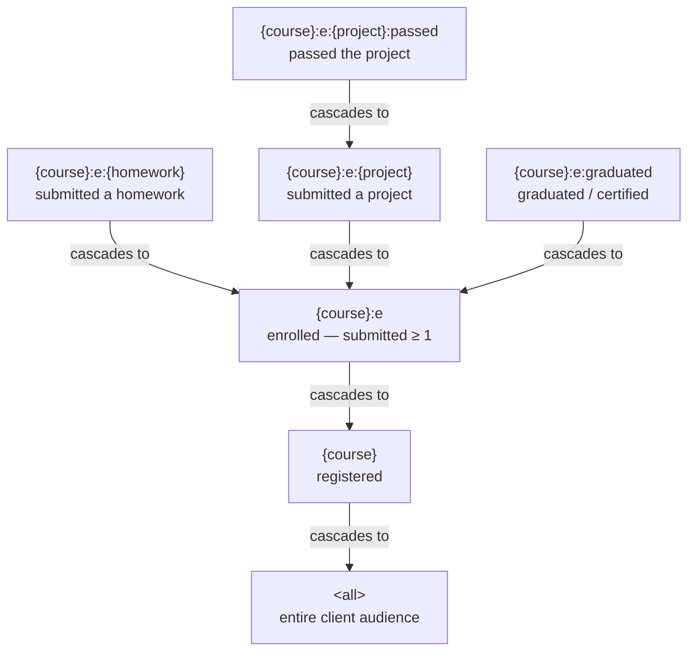

Arrows point **the way membership cascades**: a member of a leaf is automatically a
member of every ancestor. So "everyone who submitted homework 2 of ML Zoomcamp
2026" is the node `ml-zoomcamp-2026:e:homework-2`; emailing it is "name the node."
Email `ml-zoomcamp-2026:e` to reach everyone **enrolled**, `ml-zoomcamp-2026` to
reach everyone **registered**, and `<all>` to reach everyone. (`e` is a reserved
synthetic segment — not a real slug; see namespacing in §10 G12.)

### How CMP populates the tree — and what "registrant / enrolled / submitter" become

A learner's role is simply **where they sit in the tree**, and they get there by an
action:

| Action | Node the learner joins | cascades up to |
| --- | --- | --- |
| Registers for a course | `{course}` | `<all>` |
| Submits homework H | `{course}:e:{H}` | `{course}:e`, `{course}`, `<all>` |
| Submits project P | `{course}:e:{P}` | `{course}:e`, `{course}`, `<all>` |
| **Passes project P** — **Target** | `{course}:e:{P}:passed` | `{course}:e:{P}`, `{course}:e`, `{course}`, `<all>` |
| **Graduates the course** — **Target** | `{course}:e:graduated` | `{course}:e`, `{course}`, `<all>` |

So the old three-list model becomes tree position:

- **Registered** = member of `{course}`.
- **Enrolled (active learner)** = member of `{course}:e`. Populated **by cascade** —
  submitting anything joins `{course}:e:{item}`, which cascades into `{course}:e`.
  It is a **real, addressable node**, not a derived query.
- **Submitted item X** = member of `{course}:e:{X}`.
- **Registered but not enrolled** = in `{course}` but not `{course}:e` (registered,
  never submitted).

Anything that varies per person (score, `submitted_at`, country) lives in that
membership's metadata, never in the key.

#### Outcomes (passed, graduated) are deeper *outcome nodes*

Scope nodes fill *automatically* — you enter `{course}:e:{item}` by submitting, and
`{course}:e` (enrolled) by cascade. **Outcomes** — passing a project, graduating —
are different: they depend on CMP's scoring logic, so they **cannot be derived from
tree shape** and must be written by an explicit event.

Model each outcome as a **deeper node that cascades up**, so it stays directly
addressable for email:

- **Project graduates** (passed project P) = `{course}:e:{P}:passed`, a child of the
  project node. "You passed" / project-graduate emails name this node.
- **Course graduates** (completed / certified) = `{course}:e:graduated`, a child of
  `{course}:e` (graduates are necessarily enrolled). Certificate and alumni emails
  name this node.

CMP emits the join when it *determines* the outcome — passing at project scoring
(§4.8), graduating at certificate / course completion (§4.9). Unlike `{course}:e`
(which fills automatically by cascade), outcome nodes need explicit milestone
events. (Reserved synthetic segments — `e`, `passed`, `graduated` — must not collide
with real homework/project slugs; a small namespacing rule, §10 G12.)

> **Decision (updated):** enrolled **is** a node — `{course}:e`, filled by cascade —
> not a derived predicate and not a flat `course-enrolled` side list. The reserved
> `e` segment separates *registered* (`{course}`) from *enrolled* (`{course}:e`), so
> enrolled is directly addressable (this closes G8) while staying a clean tree level
> rather than a role-keyed list.

#### Today's implementation — to be migrated

The code does **not** use this tree yet. Today it writes flat, **role-prefixed**
keys (`course-registrants`, `course-enrolled`, `homework-submitters`, …) with **no
upward cascade** — every level is written by hand (or by the backfill command). The
redesign renames them to path keys and introduces the `e` level:

| Target tree node | Current key in code (today) | Migration |
| --- | --- | --- |
| `<all>` | the audience (`dtc-courses`) | keep |
| `{course}` | `course-registrants:{course}` | rename to path key |
| `{course}:e` | `course-enrolled:{course}` | rename to the `:e` node |
| `{course}:e:{homework}` | `homework-submitters:{course}:{homework}` | rename to path key |
| `{course}:e:{project}` | `project-submitters:{course}:{project}` | rename to path key |
| `{course}:e:{project}:passed` *(Target)* | — *(not built)* | add (outcome node) |
| `{course}:e:graduated` *(Target)* | `course-graduates:{course}` *(not built)* | add (outcome node) |

The two structural changes are **(a) pure path keys with the `:e` enrolled level**
(gap #9) and **(b) upward cascade so parents are implicit** (gap #8). Until both
land, the per-event flows in §4 describe the current flat keys — each notes the
target node it maps to.

**Two building blocks** compose every flow below:

| Building block | What it represents | Datamailer call |
| --- | --- | --- |
| **Contact** | a person in the audience | `POST /api/contacts` |
| **Recipient-list membership** | a person inside one tree node | `PUT /api/recipient-lists/{key}/members/{source_object_key}` |
| **Transactional send** | an actual email | `POST /api/transactional/send` (one person) or `POST /api/recipient-lists/{key}/transactional-send` (a whole node) |

The target maintains these nodes **by events** (§3), adds the
`{course}:e:graduated` node, and relies on **upward cascade** so parent nodes are
implicit. Today the code writes flat role-prefixed keys explicitly, with no
cascade — see the migration table above and gaps #8–#9.

---

## 3. How the audience list is maintained — keep the two in sync

This is the core design decision, so it gets its own section.

**Guiding principle: keep CMP and Datamailer continuously synchronized — never let
them diverge.** Every change in CMP is mirrored to Datamailer *as it happens*, so
Datamailer's copy always matches CMP. There is no separate "rebuild the list"
step, because the list never went out of sync in the first place.

**We explicitly reject reconcile-at-send.** Stopping to re-query the whole
database, rebuild a full recipient snapshot, and diff it against Datamailer on
*every* email is fragile and slow — it treats divergence as normal and papers over
it once per send, instead of preventing it. The fix for "the two might disagree"
is to **not let them disagree**: emit the events reliably.

**Target: CMP maintains Datamailer's tree as a live list by emitting events. The
list in Datamailer is the audience. A send just names a node.**

Every membership change is one small event from CMP to Datamailer:

| When this happens in CMP | CMP emits |
| --- | --- |
| Learner registers | add member to `{course}` |
| Learner submits homework / project | add member to `{course}:e:{item}` (cascades up) |
| Learner is scored | update that member's metadata (score) on the node |
| Learner completes / is certified | add member to `{course}:e:graduated` |
| Learner toggles a preference / unsubscribes | update / remove the contact or membership |

Datamailer applies each event and keeps the node current. When it's time to email
"everyone who submitted homework 2," CMP makes **one call** — "send template T to
node `{course}:homework-2`" — and Datamailer already holds the right members and
their metadata.

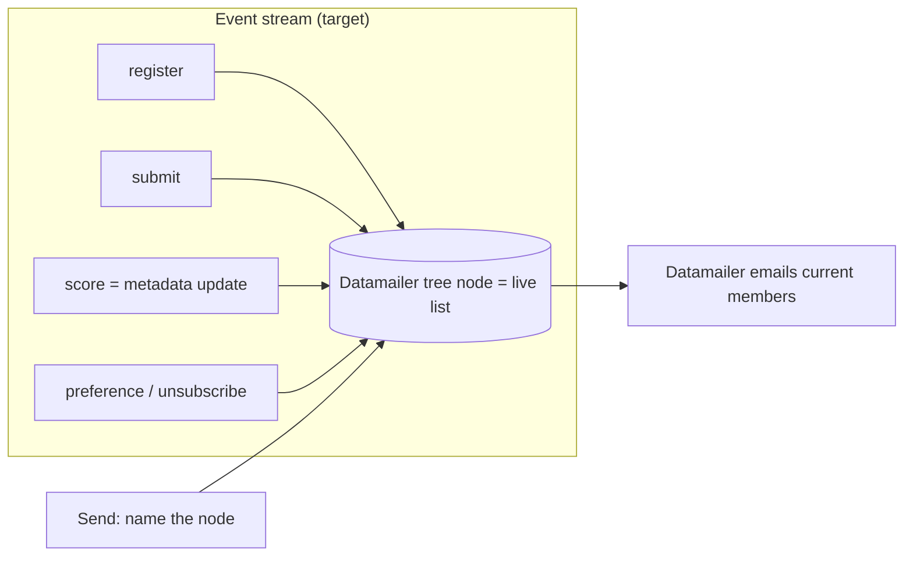

**No reconcile at send time.** CMP does not re-query its database and ship a full
snapshot with `remove_absent_members` on every send. The list is already correct
because the events kept it correct.

### Some events are computed, not user actions

Not every event is a single user click. Datamailer cannot know things CMP computes
at a lifecycle transition — **final scores, the peer-review assignment graph
(who reviews whom), pass/fail.** These reach Datamailer because **the computation
itself is an event source.** Two kinds of event:

- **Action events** — one user action → one event (register, submit). The submitter
  *set* is already current at form-close this way: every submission emitted a join.
- **Computed (batch) events** — at a transition CMP computes derived state and emits
  the results as a batch of **member-metadata updates and outcome-node joins**
  (scoring → per-submission scores + `:passed`; project form closes → each
  reviewer's assigned-project links as metadata). Datamailer never runs course
  logic — CMP computes, then tells it.

**This is bulk-upsert, not reconcile.** The batch *pushes what CMP computed*
(`members/bulk-upsert`, keyed by `source_object_key`); it does **not** diff the
audience or remove-absent. Keyed by `source_object_key`, bulk-upsert
creates-or-updates, so it is also self-healing for membership — a member is correct
even if an earlier join was missed.

**Transport — two paths by size.** A cohort batch can be large (thousands of
submitters with score metadata), so choose the transport by size:

- **Inline, chunked** *(default)* — POST to `members/bulk-upsert` in pages of
  ~500–1000. Each page is small, individually retriable, and acks synchronously.
  Fine up to a few thousand members.
- **By reference** *(large batches)* — CMP writes the batch as a **JSONL** file
  (one member per line — *streamable*, unlike a single JSON array or YAML), uploads
  it to **its own S3**, and hands Datamailer a **time-limited pre-signed URL**.
  Datamailer fetches and ingests **asynchronously**, returning an import-job id; the
  **send waits for the import to ack** (G7). This keeps CMP's bucket private (no
  cross-account IAM) and decouples transfer from processing.

Use **JSONL, not YAML** — YAML isn't streamable and is slow to parse at scale. The
outbox holds a *reference* to the file, not thousands of individual events. This is
still bulk-upsert (push what changed), never reconcile. (gap #12)

**CMP builds the batch from its own data — it does not mirror Datamailer's list.**
To push scores it iterates its **own** submissions; to push assignments, its **own**
assignment graph. It needs neither a local copy of node membership nor any
subscription state: preferences live in Datamailer (§5) and are applied at delivery,
so the batch includes *everyone who did the work* and Datamailer suppresses opt-outs.

**What triggers the batch:** the CMP-side transition — never the send, never
Datamailer. Either an **operator action** in cadmin (Score homework, Assign peer
reviews, Score project) or a **scheduled job** (EventBridge) for time-based
transitions. ("Form closes" is not itself an event — the trigger is the operator
action allowed *after* the deadline, or a scheduled job.)

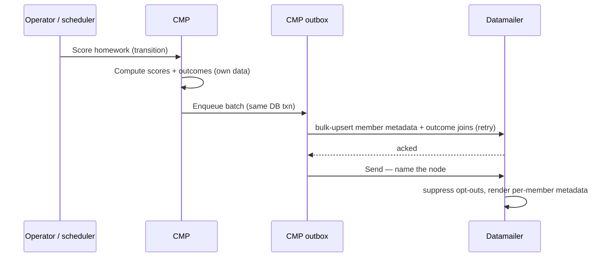

The send fires **only after the batch is acked** (gap #10 reliable emission, G7
ordering), so no one is emailed with missing scores.

The same **compute-then-bulk-push** pattern also handles *negative* audiences —
"who has **not** done X" (deadline reminders). CMP computes the set (Datamailer
can't, it's a set-difference) and materializes it as a **transient send-list**.
Note the distinction: the **durable audience tree** is never reconciled (§3's
rule); a reminder list is a separate, **send-scoped** object CMP legitimately
recomputes each run. See §4.10 and G3.

### What we need to do to get there

Event-driven is only correct if the event stream is **complete and reliable**.
That is the work:

1. **Emit every membership event — including removals and preference changes.**
   Today CMP emits joins (submissions) but **not** preference/unsubscribe changes
   from the CMP profile (gap #1), and rarely emits removals. The target must emit
   all of them so the list never silently drifts.
2. **Make emission reliable (transactional outbox + retry).** A dropped event
   means a wrong list with no automatic correction. CMP should write events to an
   outbox in the same DB transaction as the change, then deliver with retry, so no
   event is ever lost (gap #10).
3. **Seed once, and only when integrating midway (bulk API).** The single
   legitimate use of bulk/reconcile is **onboarding data that predates the
   integration** — people who already registered or submitted before Datamailer
   was wired in (or before the key migration). A one-time script loads them per
   node through the **bulk API** (`members/bulk-upsert`), then we switch to events.

After that seed, the system is **purely event-driven — there is no reconcile in
normal operation.** Reconcile is a migration tool, not a send-time step.

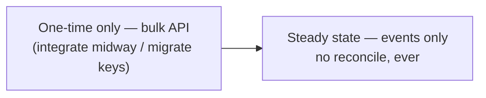

> **Today (the delta to close):** the current code does the opposite — it treats
> Datamailer's accumulated list as untrusted and **reconciles a full DB snapshot
> on every score send** (`member_sync: reconcile`, `remove_absent_members: true`).
> That stopgap exists *because* the event stream is incomplete today (preferences
> aren't pushed at all). Once steps 1–2 land, the per-send reconcile goes away and
> bulk-load is used only for the one-time midway onboarding above.

---

## 4. Lifecycle, event by event

Each subsection is one event: a diagram, what fires, which preference gates it,
and Today vs Target.

A learner's whole journey:

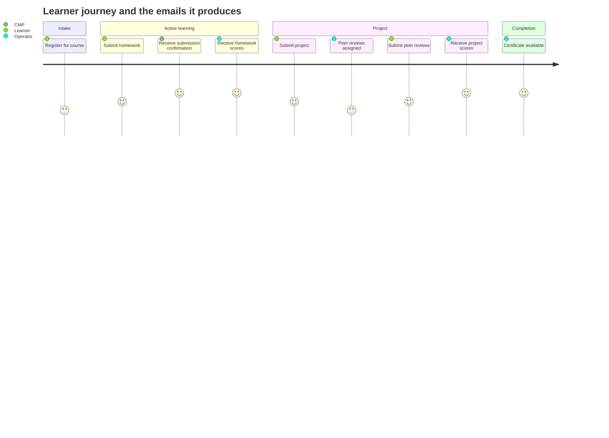

### 4.1 Course registration

A person fills the registration form. This is **interest capture, not email
subscription** — no email is sent.

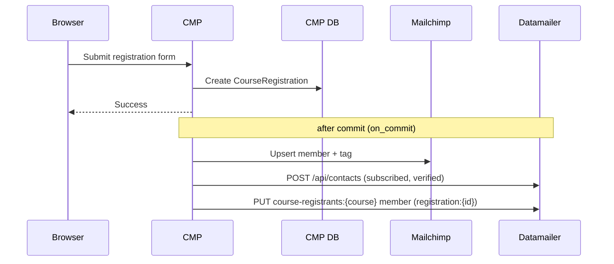

- **Event (target):** add member to node `{course}` (cascades to `<all>`).
  Registering is simply what puts a learner in the course audience.
- **Contact:** upserted as `status: subscribed`, `verified: true`,
  `email_validation: externally_validated` — the form requires newsletter
  consent, so we mark it validated.
- **Preference:** none gates this; it sends no email.
- **Email sent:** none.

**Today (delta):** already emits the membership, but under the role-prefixed key
`course-registrants:{course_slug}` (or `:{campaign_slug}` if no course is attached
yet) — to be renamed to the path key `{course}` (gap #9). A parallel Mailchimp
sync runs too, eventually retired once Datamailer is the single audience store.

### 4.2 Course enrollment

Enrollment is created **implicitly on the first submission** (`get_or_create`),
not by a separate action. A `post_save` signal fires **only on creation**.

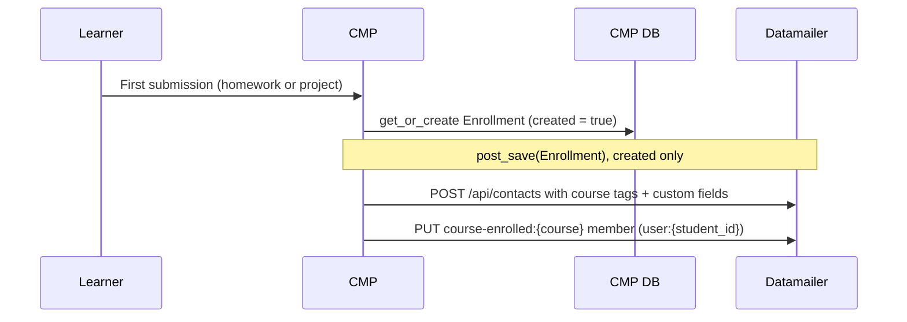

In the target there is **no `enrolled` list**. "Enrolled" is derived — a member of
`{course}` who has ≥ 1 child membership (§2). The first submission's node join
(§4.3 / §4.5) is what makes the learner enrolled; the only extra thing to do here
is **enrich the contact**.

- **Event (target):** on first submission, enrich the contact with cohort tags
  (`course-{family}`, `course-cohort-{course}`) and custom fields (course
  slug/title/family/cohort). No separate `enrolled` membership is written.
- **Preference:** none; no email.

**Today (delta):** the code materialises a real `course-enrolled:{course_slug}`
list (member key `user:{student_id}`) via a `post_save` signal that fires **only
on create** (`if not created: return`). The target drops that list (gap #9). ⚠️ The
only-on-create guard also means later changes (e.g. a preference toggle) never
re-sync the contact — see §5 and gap #1.

### 4.3 Homework submission (and resubmission)

Two things happen on submit, as two separate calls: a **confirmation email** and
a **list-membership upsert**.

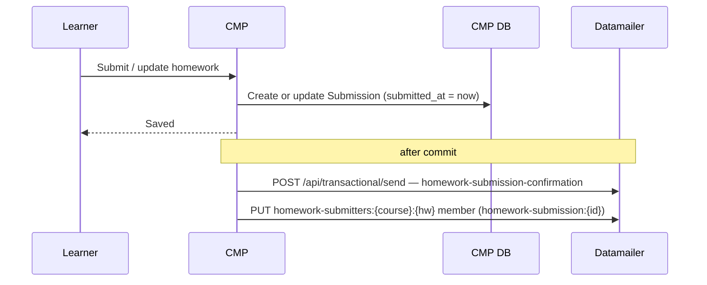

- **Confirmation gated by:** `email_submission_confirmations` (default `True`).
- **Node joined:** `{course}:e:{homework}` (today keyed
  `homework-submitters:{course}:{homework}`, gap #9), member key
  `homework-submission:{submission_id}`.
- **Resubmission:** updating a submission refreshes `submitted_at`, so:
  - the confirmation's idempotency key
    (`homework-submission:{id}:{submitted_at_iso}`) **changes → a new
    confirmation email is sent** for every update;
  - the list member is **upserted in place** (same `source_object_key`, new
    metadata/timestamp/scores).

**Today:** confirmation-on-submit and confirmation-on-update both fire; membership
upserts in place. **Target:** keep — re-sending the confirmation on update is
correct because the learner changed what they submitted (see the
[resubmission design question](#q2-re-sending-after-an-update)).

### 4.4 Homework scoring (operator publishes results)

An operator scores the homework in cadmin. CMP persists scores, **pushes each
score as a metadata update on the member's node**, then triggers one send that
just **names the node** — Datamailer already holds the members.

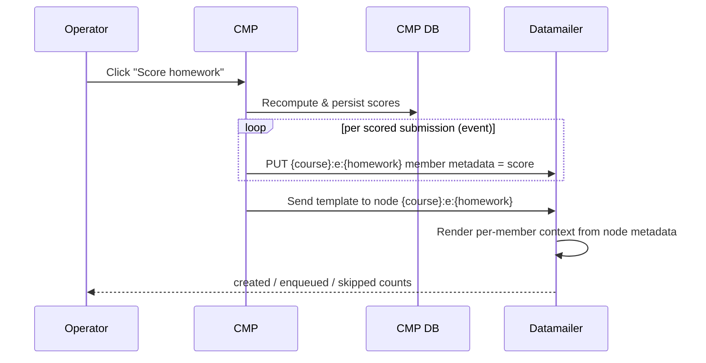

- **Audience:** node `{course}:e:{homework}` — no snapshot, no `remove_absent`. The
  node is already correct because submission and preference events kept it correct.
- **Category:** submission — Datamailer suppresses opted-out contacts at delivery
  (§5), not a per-send DB filter.
- **Idempotency:** base key `homework-score:{course}:{homework}`, Datamailer
  appends each member's `source_object_key` → safe to re-run.

**Today (delta):** the code instead **builds a full submitter snapshot from the DB
and sends it with `member_sync: reconcile` + `remove_absent_members`** — the
per-send reconcile §3 removes. It filters the snapshot by preference, drops
no-email and duplicate submissions, and (usefully) still includes submissions that
predate the integration. The target replaces that snapshot with the event-kept
node; the preference filtering moves to preference events (gap #1), and reliable
emission (gap #10) is what lets us trust the node without the snapshot.

### 4.5 Project submission

Identical shape to homework submission, on the project list.

- **Confirmation gated by:** `email_submission_confirmations`.
- **Node joined:** `{course}:e:{project}` (today keyed
  `project-submitters:{course}:{project}`, gap #9), member key
  `project-submission:{submission_id}`.
- **Resubmission:** same semantics as homework (new `submitted_at` → new
  confirmation; member upserted in place).

**Today / Target:** same as homework.

### 4.6 Peer-review assignment (the separate project flow)

Projects have an extra step homework doesn't. After the submission deadline, an
operator **assigns peer reviews**, which moves the project to `PEER_REVIEWING`
and opens a review window. Submitters get a "go review your peers" email.

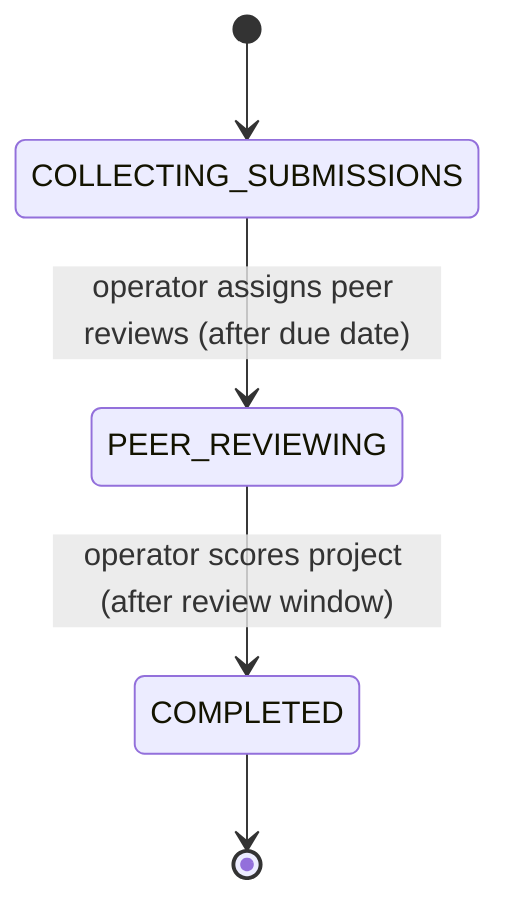

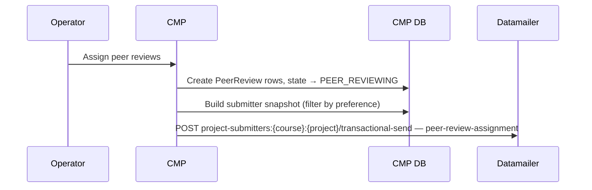

- **Computed batch (target):** assigning reviews is a *computed transition* (§3) —
  CMP computes who reviews whom and pushes **each reviewer's assigned-project links
  as member metadata** (bulk-upsert), *then* sends. The submitter set itself is
  already present from join events; only the assignment data is new.
- **Send (target):** name the node `{course}:e:{project}` — Datamailer already holds
  the members; the email renders each reviewer's links from the pushed metadata. No
  snapshot.
- **Gated by:** `email_submission_confirmations`.
- **Idempotency:** `peer-review-assignment:{course}:{project}`.

**Today (delta):** the code builds a submitter snapshot and sends it with the
per-send reconcile (the §3 stopgap), to the `project-submitters` key.
Note this is the *"go review your peers"* assignment email, sent once to all
submitters. The *reminder* for those who **still owe** reviews is separate and
CMP-computed at run time (§4.10) — it needs no maintained node (gap #2 is optional).
Also consider whether "go do your reviews" should be gated by
`email_deadline_reminders` rather than `email_submission_confirmations` (see
[preference granularity](#q3-preference-granularity)).

### 4.7 Peer review submitted (by a learner)

When a learner submits their evaluation of a peer, CMP records it and shows a
thank-you message — **nothing is sent to Datamailer today**. There is no
peer-review-submission confirmation email and no list update.

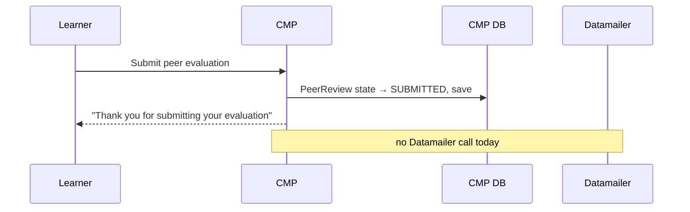

- **Fires:** `project_eval_post_submission` (`courses/views/project.py`) — sets the
  review state to `SUBMITTED` and saves. No email, no Datamailer call.
- **Email sent today:** none.

**Today:** **not** a Datamailer integration point. **Target (candidate):**
(a) optionally send a "your reviews are recorded" confirmation gated by
`email_submission_confirmations`, and/or (b) remove the learner from a
`peer-review-pending` audience once they've finished all assigned non-optional
reviews — which would make the peer-review-due reminder (§4.10) self-clearing.
⚠️ both depend on the `peer-review-pending` list (gap #2) and a new template.

### 4.8 Project scoring

After the review window closes, the operator scores the project. CMP computes
median peer scores, persists them, moves the project to `COMPLETED`, and — exactly
like homework scoring (§4.4) — **pushes each score as member metadata on the node,
then names the node** to send.

- **Node:** `{course}:e:{project}` (today keyed `project-submitters:{course}:{project}`).
- **Outcome event (target):** learners whose submission `passed` also join the
  outcome node `{course}:e:{project}:passed` (§2), enabling later project-graduate /
  "you passed" emails.
- **Category:** submission — Datamailer-enforced at delivery (§5).
- **Idempotency:** `project-score:{course}:{project}`.

**Today (delta):** same per-send reconcile snapshot as §4.4; the target replaces it
the same way (events keep the node correct).

### 4.9 Certificate availability

When a certificate URL is published for an enrollment (bulk upload / API), the
learner gets a one-off email. This one is a **direct send**, not a list send.

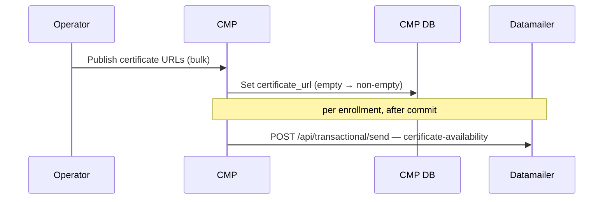

- **Gated by:** `email_course_updates` (default `True`) — it's a course
  operational update, not a submission confirmation.
- **Idempotency:** `certificate-available:{enrollment_id}` (per enrollment).
- **List:** none — direct send to one address.

**Today:** direct send, gated by `email_course_updates`. **Target:** issuing a
certificate is the **graduation outcome event** — the learner joins the outcome
node `{course}:e:graduated` (§2), and the certificate email is a send to that node.
The same node powers later alumni / graduate campaigns.

### 4.10 Deadline reminders

CMP owns scheduling because only CMP knows who is enrolled, who has submitted,
and who still owes peer reviews. A scheduled command (`send_deadline_reminders`,
run by EventBridge) recomputes eligibility from current state, reconciles each
reminder's recipient list, and triggers one list send per active reminder event.
All three reminders are gated by `email_deadline_reminders` and **skip anyone who
has already done the thing** the reminder is about.

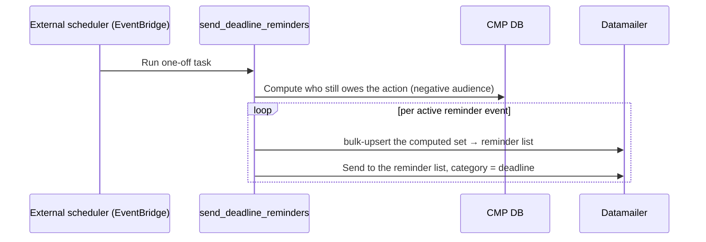

> **Reminders are a *negative* audience — a CMP-computed send-list.** Their audience
> is *who has **not** submitted / still owes reviews* — a set-difference Datamailer
> can't derive. So the scheduled CMP job **computes the set and pushes it as a
> transient send-list** via bulk-upsert (file-by-reference if large, §3 / gap #12),
> then sends. This does **not** violate "no reconcile" (§3): that rule governs the
> durable audience *tree*; a reminder list is a separate, send-scoped object. See G3.

Three reminder types, **all implemented today**:

| Reminder | When | Audience (who gets it) | List key |
| --- | --- | --- | --- |
| **Homework due** | 24h before due | enrolled, **not yet submitted** | `deadline-reminders:homework:{course}:{hw}:24h` |
| **Project due** | 7d **and** 24h before due | enrolled, **not yet submitted** | `deadline-reminders:project-submission:{course}:{project}:{7d\|24h}` |
| **Peer review due** | 24h before review deadline | submitted a project **and still has ≥1 unsubmitted, non-optional** assigned review | `deadline-reminders:peer-review:{course}:{project}:24h` |

Idempotency keys mirror the event (`deadline-reminder:homework:{hw_id}:24h`,
`deadline-reminder:project:{project_id}:{7d|24h}`,
`deadline-reminder:peer-review:{project_id}:24h`) and omit the command timestamp,
so the command can run repeatedly without duplicating.

**All three are computed the same way — none need a maintained "pending" node.**
CMP queries its own data each run and pushes the result:

- **Homework / project due** are conceptually a node diff —
  `{course}:e` (enrolled) **minus** `{course}:e:{item}` (submitted it). CMP runs the
  diff from source (more robust than asking Datamailer to diff nodes, and no new
  Datamailer capability).
- **Peer-review due** has no clean node diff ("still owes reviews" depends on the
  assignment graph and review progress), so CMP queries `PeerReview` rows
  (`state=TO_REVIEW`, non-optional) directly. Same mechanism, richer query.

Eligibility is **self-clearing**: finishing the action (submitting, completing
reviews) drops the learner from the next run's computed set — no node removal
needed. A dedicated `peer-review-pending` node (gap #2) is therefore **optional** —
justified only if a *non-reminder* feature needs to address "who owes reviews"
directly via Datamailer.

**Today:** all three implemented; because eligibility is recomputed each run,
moving a deadline just changes the next run (no campaign to update).
**Target:** keep; extend the "tighten audience to who still owes work" pattern.

### 4.11 General course announcements (course starts, module starts) — not built

Broad, non-personalized announcements — "the course starts Monday", "module 3 is
live" — are **not implemented anywhere today**. The `email_course_updates`
preference exists (its help text even mentions course-start announcements), but
no code sends them.

These are **campaign territory, not transactional**: one message to a whole
audience node, not one-per-learner with per-learner context.

- **Audience:** a tree node — `<all>` for a platform-wide notice, `{course-slug}`
  for one course/cohort, optionally `{course-slug}` filtered by module progress.
- **Category:** course updates — Datamailer-enforced at delivery (§5).
- **Mechanism (target):** a Datamailer **campaign** with an external key (Part 2 →
  Broad course emails / Campaign API, gap #5), so CMP can create / queue / cancel
  a scheduled announcement and Datamailer snapshots recipients at queue time.

**Today:** absent — any such email is sent by hand from the Datamailer operator
UI. **Target:** CMP-driven campaign API keyed per announcement. ⚠️ depends on the
campaign API (gap #5).

---

## 5. Preferences — store them in Datamailer, not CMP

The cleanest way to keep two stores in sync is to **not have two stores.** So in
the target, **CMP does not store email preferences at all.** They live only in
Datamailer, which already owns unsubscribe and suppression state. With a single
store, preference divergence is *impossible* — there is nothing to sync.

In the target, **CMP barely touches preferences** — it hosts the settings UI but
**proxies reads and writes to Datamailer asynchronously**, and stores nothing.

- **Settings page = CMP-hosted, preferences loaded asynchronously.** CMP renders
  its settings page **immediately** and does **not** block on Datamailer. The email
  preferences panel fetches the learner's toggles **asynchronously** (a client-side
  call to CMP's own backend) *after* the page is shown. If Datamailer is slow or
  down, the page still loads — only the preferences panel shows a **fallback**
  ("email preferences are temporarily unavailable — try again later").
- **CMP backend proxies to Datamailer (no storage).** The async request hits CMP's
  own backend, which calls Datamailer for that contact's toggles and relays them;
  saving a toggle goes the same path (browser → CMP backend → Datamailer). CMP is a
  pass-through and persists no preference. Identity is ordinary: the learner is
  logged into CMP, and CMP's backend authenticates to Datamailer with its API key —
  no token is handed to the browser and nothing is embedded from Datamailer.
- **Categories are generic, tag-driven, and client-defined.** A client defines its
  own set of subscription categories; each category is a **tag**, and every
  triggered message type declares the category tag it belongs to. The settings
  panel renders one toggle per category that client defined. **CMP happens to
  define three** — but nothing is hardcoded to three; another client defines its own.
  This mirrors the generic audience tree (§2): generic on the Datamailer side,
  specialized per client.
- **Sending = Datamailer enforces.** A send names a node and declares its category
  tag; Datamailer suppresses contacts who toggled that category off, at delivery.
  CMP never filters by a stored preference.

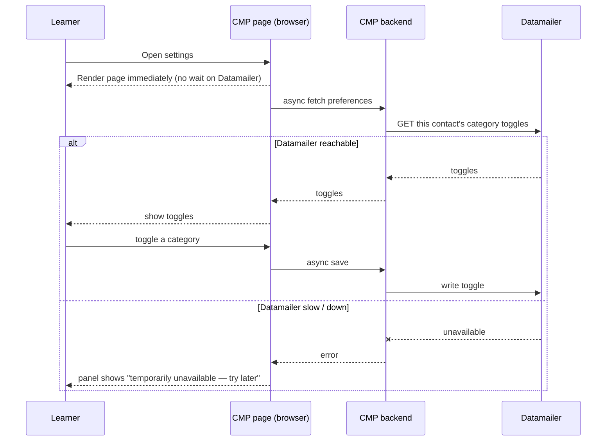

CMP's category set — **a client-defined example; the model itself is generic**:

| CMP category (tag) | Message types it gates |
| --- | --- |
| **submission & results** | submission/score confirmations, peer-review assignment |
| **deadline reminders** | the three reminders (§4.10) |
| **course updates** | certificate availability, announcements |

**No duplication — CMP never needs a local copy.** The three places CMP might seem
to need preferences, it doesn't:

- *Settings page* — proxies to Datamailer (above); stores nothing.
- *Sending* — CMP names a node + category; **Datamailer suppresses opt-outs at
  delivery** (gap #11). CMP never filters by preference.
- *Audience computation, incl. reminders* — CMP computes by **who did the work**
  (its own enrollments / submissions), not by preference. A reminder batch is
  "everyone who hasn't submitted"; Datamailer drops the deadline-unsubscribed when
  it sends. The batch may be slightly larger than what's delivered — that's fine;
  pre-filtering would require a local preference copy, i.e. the duplication we are
  removing.

(The **only** duplication is in *today's* code — three CMP booleans plus
Datamailer's own unsubscribe state — and they drift. See below.)

### Today (the delta to close)

Today CMP **does** store three boolean fields on the user
(`email_submission_confirmations`, `email_deadline_reminders`,
`email_course_updates`, all default `True`) and gates every send by reading them.
Sync is **one-way and broken**: a Datamailer unsubscribe webhook writes back to
those fields (`subscription.unsubscribed` + a recognized `preference_key`), but a
**CMP-side toggle pushes nothing** to Datamailer (the contact is synced only on
*creation*, `if not created: return`). That asymmetry is exactly the divergence we
are designing out.

### Work to do

- **Datamailer:** a per-contact, per-category preference **read + write** API with
  client-defined category tags (gap #1); **delivery-time enforcement** of a send's
  declared category tag (gap #11).
- **CMP:** host the settings UI and load/save preferences **asynchronously via its
  backend**, proxying to Datamailer, with the unavailable-fallback panel; **remove
  the three preference fields** and all per-send preference gating.
- Keep the existing Datamailer→CMP webhook only for *storing* events for support
  (bounces, complaints) — not as the preference store.

---

## 6. Where Current and Target differ — at a glance

| Area | Today | Target |
| --- | --- | --- |
| Audience model | flat role-prefixed lists incl. a materialised `enrolled` | **path-keyed tree**; `enrolled` = `{course}:e` node; `{course}:e:graduated` added (gap #9) |
| List maintenance | **reconcile a full DB snapshot on every send** | **event-driven** — emit each change; Datamailer's tree is the live list; **no per-send reconcile** (§3) |
| Bulk / reconcile API | used at send time | **one-time only** — midway onboarding & key migration |
| Event emission | joins only; no preference/unsubscribe push; rarely removals | **complete + reliable** (outbox + retry), incl. removals & preferences (gap #10) |
| Preference sync | Datamailer → CMP only | **bidirectional** (add CMP → Datamailer, gap #1) |
| Cascade | none — every level written by hand | adding a leaf implies ancestors (gap #8) |
| Peer-review audience | all project submitters | only those who still owe reviews (gap #2) |
| Certificate audience | direct send, no list | `{course}:e:graduated`-backed |
| Broad announcements | operator UI campaigns | CMP-driven campaign API with external key (gap #5) |
| Submit confirmation + membership | two separate calls | possibly unified trigger-on-membership (open, §7) |
| Preference granularity | results share `email_submission_confirmations` | possible dedicated results / review prefs (open, §7) |

---

## 7. Open design questions

These are the "think about what makes sense" items. Each is a decision, not yet
a commitment.

### Q1. Trigger-on-membership vs separate send

Today, submitting homework makes **two** calls: send the confirmation email, and
upsert the list member. A campaign-style alternative is "adding a member can
optionally **force a send**" — one call that both records membership and emails.

- **For:** fewer calls; membership and notification can't drift apart.
- **Against:** the two have genuinely different lifecycles. Membership is *funnel
  state* (durable); the confirmation is a *per-event transactional* keyed to
  `submitted_at`. Score/result emails already use the unified pattern
  (list + reconcile + send) and that's correct *because the operator chooses the
  moment*. Auto-sending on every membership add would email people at the wrong
  time (e.g. a backfill or a resubmission shouldn't blast a score email).

**Leaning:** keep submit-time confirmation and membership separate; keep
operator-time results as the unified list-send. Add a *force-send* option to the
membership API only as an explicit, opt-in flag for special cases — never the
default. (⚠️ force-send-on-membership flag does not exist on the Datamailer side
today.)

### Q2. Re-sending after an update

If a learner edits a submission, should they get a fresh email?

- **Submission confirmation:** **yes, today** — `submitted_at` changes, the
  idempotency key changes, a new confirmation goes out. This is correct: the
  content they submitted changed.
- **After scores are published:** today, editing a submission does **not**
  re-trigger a score email (scores are operator-published, idempotent per
  homework). That's the safe default — we don't want edits to silently re-blast
  scores. If we ever want "your updated submission was re-scored" emails, that's
  a deliberate new event with its own key, not a side effect of the edit.

**Leaning:** keep current behavior; make any post-score re-send an explicit
operator action.

### Q3. Preference granularity

Today a single `email_submission_confirmations` gates submission confirmations,
score notifications, **and** peer-review assignment. Those are arguably three
different intents (I confirmed something / here are your results / go do work).

- Splitting into e.g. `email_results_notifications` and treating peer-review
  assignment as a `email_deadline_reminders`-style nudge would give learners
  finer control.
- The contact tags already hint at this (`pref-results-notifications` exists as a
  tag) but there is **no** matching user field.

**Leaning:** worth doing if learners complain about over-emailing; low priority
otherwise. Decide before adding more result-type emails.

---

## 8. Glossary of keys

```text
# Audience tree nodes — TARGET (pure path keys, §2; 'e' = reserved enrolled segment)
<all>
{course_slug}                                  # registered
{course_slug}:e                                # enrolled (submitted >= 1)
{course_slug}:e:{homework_slug}                # submitted the homework
{course_slug}:e:{project_slug}                 # submitted the project
{course_slug}:e:{project_slug}:passed          # outcome: passed the project
{course_slug}:e:graduated                      # outcome: completed / certified

# Current keys in code — TODAY, to migrate (gap #9)
course-registrants:{course_slug}                   -> {course_slug}
course-enrolled:{course_slug}                      -> {course_slug}:e
homework-submitters:{course_slug}:{homework_slug}  -> {course_slug}:e:{homework_slug}
project-submitters:{course_slug}:{project_slug}    -> {course_slug}:e:{project_slug}
peer-review-pending:{course_slug}:{project_slug}   -> {course_slug}:e:{project_slug} review-pending subset  # not built ⚠️
certificate-eligible:{course_slug}                 -> {course_slug}:e:graduated         # not built ⚠️

# Deadline-reminder lists (scoped to who still owes the action)
deadline-reminders:homework:{course_slug}:{homework_slug}:24h
deadline-reminders:project-submission:{course_slug}:{project_slug}:{7d|24h}
deadline-reminders:peer-review:{course_slug}:{project_slug}:24h

# Member keys (source_object_key)
registration:{registration_id}
user:{student_id}                                     # today's enrolled list (dropped in target)
homework-submission:{submission_id}
project-submission:{submission_id}

# Idempotency keys (events)
homework-submission:{submission_id}:{submitted_at_iso}
project-submission:{submission_id}:{submitted_at_iso}
homework-score:{course_slug}:{homework_slug}
project-score:{course_slug}:{project_slug}
peer-review-assignment:{course_slug}:{project_slug}
certificate-available:{enrollment_id}
deadline-reminder:homework:{homework_id}:24h
deadline-reminder:project:{project_id}:{7d|24h}
deadline-reminder:peer-review:{project_id}:24h
```

---

## 9. Capability gaps (things to raise on the Datamailer side)

Collected from the sections above — what the Target needs that may not exist yet.
Datamailer currently has only a sandbox deployment; none of this implies a
production rollout.

| # | Gap | Needed for | Side |
| --- | --- | --- | --- |
| 1 | **Datamailer owns preferences** — a per-contact, per-category preference **read + write** API with **client-defined category tags**; CMP hosts the settings UI but proxies to it **asynchronously** and stores nothing | Single store, no divergence (§5) | Datamailer + CMP |
| 2 | `peer-review-pending` node *(optional)* — only if a **non-reminder** feature needs to address "who still owes reviews" directly; reminders don't need it (CMP computes the set, §4.10) | Optional targeted addressing | CMP + Datamailer |
| 3 | `certificate-eligible` / `course-graduates` list | Graduate campaigns; list-backed certs | CMP + Datamailer |
| 4 | **Force-send-on-membership** flag (opt-in) | Q1, special-case unified add+send | Datamailer |
| 5 | Campaign API with external key (`PUT /api/campaigns/{key}`, queue, cancel) | CMP-driven broad announcements | Datamailer |
| 6 | Dedicated result / review preference fields | Q3 finer learner control | CMP |
| 7 | Resubscribe → optionally re-enable CMP preference (today: stored only) | Honor re-opt-in | CMP policy + Datamailer metadata |
| 8 | **Upward-cascade membership** — adding a member to a node implies all ancestor nodes up to `<all>` | Generic audience tree (§2); CMP stops maintaining parent levels by hand | Datamailer |
| 9 | **Pure path key scheme** — drop role prefixes (`course-registrants`→`{course}`, `homework-submitters`→`{course}:e:{homework}`); add the `{course}:e` enrolled level | Audience tree (§2) | CMP (+ Datamailer list rename) |
| 10 | **Reliable event emission** — transactional outbox + retry for every membership event, plus removals, so the list never drifts and no per-send reconcile is needed | Event-driven list (§3) | CMP |
| 11 | **Delivery-time category enforcement** — a node send declares its category and Datamailer suppresses contacts opted out of that category | §5 sending | Datamailer |
| 12 | **Bulk import by reference** — accept a fetchable JSONL file (CMP S3 pre-signed URL), ingest asynchronously, expose import-job status to ack before send | Large computed batches & negative audiences (§3, §4.10) | Datamailer |

---

## 10. Unresolved design gaps

Holes in the **design itself** (distinct from the build work in §9). Each needs a
decision before implementation. Ordered roughly by risk; "Lean" is a proposed
resolution, not a commitment.

### Must resolve first

**G1. Removal & reverse-cascade.** The tree (§2) defines *joining* — add a leaf,
cascade up — but not *leaving*. When a learner withdraws or a submission is deleted,
what removes them from `{course}:{item}`, and does it cascade **down** from
`{course}`? Cascade-up for joins is easy; removal is the hard half and is undesigned.
*Lean:* reference-count membership — a contact stays in `{course}` while any child
membership or explicit registration membership remains; removed when the last goes.

**G2. Explicit vs cascade-implied membership at the same node.** A contact reaches
`{course}` both directly (registration, key `registration:{id}`) and by cascade
(submission). With one membership per contact per list, which `source_object_key`
and metadata win, and does leaving the child strand them in `{course}`? Ties to G1.
*Lean:* the cascade membership is implicit and reference-counted, never overwrites an
explicit one; an explicit registration membership is its own reason to stay.

**G3. Reminders are a *negative* audience — RESOLVED: CMP computes the list.**
Deadline reminders (§4.10) target who has **not** submitted / **still owes** reviews
— a set-difference (`{course}` minus `{course}:{item}`) Datamailer can't derive.
**Decision:** CMP computes the set each run and materializes it as a **transient
send-list** via bulk-upsert (inline, or file-by-reference for large batches, gap
#12), triggered by the scheduled CMP job; Datamailer set-difference is **not**
needed. This does **not** violate §3's "no reconcile" — that rule governs the
*durable audience tree*; a reminder list is a separate, send-scoped object CMP
recomputes per run. (Remaining detail: whether to reuse one reminder-list key per
event and replace its contents each run, or create a per-run list.)

**G4. Email change = re-key the contact.** Datamailer keys contacts by email;
changing it in CMP strands the contact, its memberships, and preferences on the old
address. We need an email-change event that re-keys / migrates the Datamailer contact.

### Required for §5 and compliance

**G5. Contact lifecycle & default preferences.** The settings panel (§5) assumes a
contact already exists with sane defaults. Define **when** the Datamailer contact is
created (registration? account creation?) and the **default** category state before
any toggle (opted-in to all?).

**G6. Account deletion / erasure (GDPR).** No event deletes a Datamailer contact +
memberships + preferences when a learner deletes their account or requests erasure.
Required for EU learners.

### Lower risk

**G7. Score-metadata ↔ send ordering.** Scoring (§4.4/§4.8) pushes per-member
metadata then sends the node; nothing guarantees all metadata landed (or none failed)
before the send renders. Define ordering/consistency — e.g. send only after metadata
writes are acked.

**G8. "Enrolled" must be queryable — RESOLVED.** Earlier enrolled was a *derived*
predicate, which Datamailer might not be able to query. Now enrolled is the real
node `{course}:e`, filled by cascade (§2) — directly addressable, no query needed.
Closed.

**G9. Course family vs cohort.** Nodes are per-cohort (`ml-zoomcamp-2026`); "everyone
who ever did ML Zoomcamp" has no node and falls back to family tags. Document the
tree/tag boundary.

**G10. Volunteer / review-only participants** (reviewers who didn't submit a project)
have no obvious node — decide where they live.

**G11. Category taxonomy.** "Submission confirmation" and "results" share one category,
and peer-review assignment is parked in it (see §7 Q3). Revisit before adding more
result-type emails.

**G12. Reserved synthetic segments.** The tree uses reserved segments that are not
real slugs — `e` (enrolled), `passed`, `graduated` (§2). These must not collide with
a real homework/project slug (e.g. a homework literally slugged `e`). Needs a
namespacing rule — a reserved sigil such as `{course}:@e` / `{course}:@e:@graduated`,
or validation that no slug uses a reserved word.

**G13. Email links must be absolute — and tested end to end.** Every link in a
templated email (leaderboard, scores, profile, update URLs) must be a
**fully-qualified URL** (scheme + host). `public_url()` returns a **bare relative
path** when `PUBLIC_BASE_URL` is empty (`course_management/datamailer.py:258`), so a
misconfigured / unset `PUBLIC_BASE_URL` in a sending environment produces broken
links — observed in a real score-notification email as
`http:///llm-zoomcamp-2026/leaderboard` (empty host) instead of
`https://courses.datatalks.club/llm-zoomcamp-2026/leaderboard`.

**Decision: pin the host on exactly one side; never empty; never guessed.** The
link base host is *pinned configuration*, and config is split across two sides (see
[Configuration → Where configuration lives](#where-configuration-lives--two-sides)).
Two valid homes:
- **Datamailer client-global** *(preferred)* — the base host is a stable per-client
  brand value, so make it a **global client variable** on the Datamailer side;
  templates compose `{{ base_url }}/{path}` and CMP sends only paths/slugs. Pinned
  here, an empty host is impossible.
- **CMP-side** — CMP pins `PUBLIC_BASE_URL` (required in any sending environment;
  empty/scheme-only is a **hard error** at send time, not a relative path) and sends
  fully-qualified URLs; Datamailer renders verbatim.

Either way, Datamailer **never *guesses* a host from the request** — it uses a
pinned client-global or the CMP-provided absolute URL. And: an **end-to-end test**
asserting the *rendered* body has absolute `https://<host>/…` links, since today's
tests pin `PUBLIC_BASE_URL` (or set `""`) and only check context — nothing catches
a real environment shipping an empty host. (Reported by Luis Oliveira.)

---

# Part 2 — API reference

The wire-level contract behind Part 1. CMP owns course state and learner
preferences; Datamailer owns templates, sender config, suppression, delivery,
event tracking, and message history.

## Implementation status

The current CMP integration has:

- Datamailer contact sync for new users and enrollments.
- Datamailer homework and project submission confirmation emails.
- Datamailer contact status and history lookups.
- Parallel Datamailer sync for course registrations.
- Datamailer recipient-list member sync for course registrations, course
  enrollments, homework submitters, and project submitters.
- Datamailer recipient-list sends for homework and project score notifications
  and peer-review assignment.
- Datamailer certificate availability emails.
- Datamailer deadline reminder command using recipient-list sends.
- Datamailer callbacks to CMP for hard bounces, complaints, unsubscribes,
  resubscribes, transactional skips, and transactional failures.
- CMP backfill command for Datamailer recipient lists.
- Mailchimp sync for course registrations.

Planned, not implemented yet:

- CMP UI surfacing for stored Datamailer callback events.
- The capability gaps listed in [§9](#9-capability-gaps-things-to-raise-on-the-datamailer-side).

## Configuration

CMP enables Datamailer only when all required settings are present:

```text
DATAMAILER_URL
DATAMAILER_API_KEY
DATAMAILER_CLIENT
DATAMAILER_AUDIENCE
```

CMP may also set:

```text
DATAMAILER_FROM_EMAIL
DATAMAILER_STRICT
DATAMAILER_WEBHOOK_TOKEN
DATAMAILER_SYNC_ON_USER_CREATE
```

`DATAMAILER_FROM_EMAIL` is a Datamailer sender ID, not a raw email address.
Datamailer validates it against the authenticated client sender configuration.

CMP keeps transactional template keys as code-level constants. We don't add one
environment variable per template.

`PUBLIC_BASE_URL` is a CMP URL-building setting, not a Datamailer API setting.
CMP uses it when it builds links for email context.

When `DATAMAILER_STRICT=0`, CMP logs Datamailer failures and lets the course
flow continue. When `DATAMAILER_STRICT=1`, CMP raises the Datamailer API failure
to the caller.

### Where configuration lives — two sides

Configuration for the client is **split across two sides**, and each value should
have **exactly one home**:

- **Datamailer-side — global client variables.** Stable, per-client brand/delivery
  values configured once on the Datamailer side and available to every template for
  that client: sender identity, brand name/logo, legal & unsubscribe footer, support
  address, the subscription **category tags** (§5), and — a strong candidate — the
  **link base host** (so templates compose `{{ base_url }}/{path}` and CMP never
  repeats it). Pinned here, an empty host is impossible.
- **CMP-side — settings + per-send context.** Connection config (`DATAMAILER_URL`,
  `_API_KEY`, `_CLIENT`, `_AUDIENCE`), and the **per-message context** CMP computes:
  course title, slugs, scores, paths. If the base host is *not* a Datamailer
  client-global, then CMP pins `PUBLIC_BASE_URL` and sends fully-qualified URLs.

Rule of thumb: a value that's the same for the whole client → Datamailer global;
a value that varies per course/learner/message → CMP context. The link host is the
boundary case (G13) — pick one side and pin it.

## Contact sync

CMP syncs contacts when it creates users, enrollments, and course registrations
(conceptually §4.1–4.2). During rollout, CMP keeps the existing Mailchimp sync
and also upserts the registrant into Datamailer.

```text
POST /api/contacts
Authorization: Bearer <DATAMAILER_API_KEY>
```

```json
{
  "email": "learner@example.com",
  "audience": "dtc-courses",
  "client": "dtc-courses",
  "status": "subscribed",
  "verified": true,
  "email_validation": {
    "status": "externally_validated"
  },
  "tags": [
    "course-ml-zoomcamp",
    "course-cohort-ml-zoomcamp-2026"
  ]
}
```

CMP sends `status: subscribed`, `verified: true`, and
`email_validation.status: externally_validated` for course-scoped contacts. The
registration form requires newsletter consent, so CMP marks the contact verified
and externally validated. Course-scoped tags include both the family tag and
cohort tag, e.g. `course-ml-zoomcamp` and `course-cohort-ml-zoomcamp-2026`.

## Transactional sends

CMP uses Datamailer transactional email for several learner-specific events.
They call the same endpoints but trigger from different parts of the lifecycle
(see Part 1, §4).

| Trigger | Email | CMP owner | Status |
| --- | --- | --- | --- |
| Learner submits work | homework submission confirmation | homework submit view | implemented |
| Learner submits work | project submission confirmation | project submit view | implemented |
| Operator publishes results | homework score notification | cadmin homework scoring | implemented |
| Operator assigns peer reviews | peer-review assignment | cadmin project action | implemented |
| Operator publishes results | project score notification | cadmin project scoring | implemented |
| Operator publishes certificates | certificate availability | certificate bulk/API flow | implemented |
| Scheduled command runs | deadline reminders | `send_deadline_reminders` | implemented |

Single-recipient sends (submission confirmations, certificates):

```text
POST /api/transactional/send
Authorization: Bearer <DATAMAILER_API_KEY>
```

```json
{
  "email": "learner@example.com",
  "template_key": "homework-submission-confirmation",
  "from_email": "courses",
  "idempotency_key": "homework-submission:123:2026-06-18T10:00:00+00:00",
  "context": {
    "course_slug": "ml-zoomcamp",
    "course_title": "Machine Learning Zoomcamp",
    "homework_slug": "homework-1",
    "homework_title": "Homework 1",
    "update_url": "https://courses.datatalks.club/course/homework/homework-1",
    "profile_url": "https://courses.datatalks.club/accounts/settings/"
  },
  "metadata": {
    "source": "course-management-platform",
    "event": "homework_submission",
    "course_slug": "ml-zoomcamp",
    "homework_slug": "homework-1",
    "submission_id": 123
  }
}
```

List sends (score publication, peer-review assignment, deadline reminders) carry
the current member snapshot in the same request and reconcile before sending. This
is the **current** mechanism; the target replaces the per-send reconcile with
event-kept nodes — a send just names a node (Part 1, §3). The payload below is
what the code does today:

```text
POST /api/recipient-lists/{list_key}/transactional-send
Authorization: Bearer <DATAMAILER_API_KEY>
```

```json
{
  "audience": "dtc-courses",
  "client": "dtc-courses",
  "template_key": "homework-score-notification",
  "idempotency_key": "homework-score:ml-zoomcamp-2026:homework-1",
  "member_sync": "reconcile",
  "remove_absent_members": true,
  "context": {
    "course_title": "Machine Learning Zoomcamp",
    "homework_title": "Homework 1",
    "scores_url": "https://courses.datatalks.club/ml-zoomcamp-2026/"
  },
  "list": {
    "type": "homework_submitters",
    "name": "Machine Learning Zoomcamp Homework 1 submitters"
  },
  "members": [
    {
      "source_object_key": "homework-submission:123",
      "email": "learner@example.com",
      "status": "active",
      "metadata": {
        "submission_id": 123,
        "questions_score": 6,
        "learning_in_public_score": 2,
        "faq_score": 1,
        "total_score": 9
      }
    }
  ],
  "metadata": {
    "source": "course-management-platform",
    "event": "homework_score_publication",
    "course_slug": "ml-zoomcamp-2026",
    "homework_slug": "homework-1"
  }
}
```

Datamailer reconciles the list first, then creates one transactional message per
active member, merging each member's metadata into that learner's template
context. CMP remains the source of truth for scores. If the same
`idempotency_key` is sent again for the same client, Datamailer returns the
existing message and does not enqueue another email.

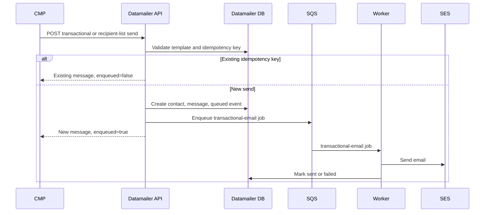

## Recipient lists

Datamailer has native recipient lists rather than using tags as lists. Tags are
audience-scoped and broad; recipient lists have client and audience scope,
membership audit, backfill support, and send-specific counters. List keys do not
need a `cmp:` prefix because the authenticated API client already scopes
ownership. (Key scheme: Part 1, §8.)

Datamailer tables:

```text
recipient_lists
- client, audience, key, type, name, metadata
- member_count, active_member_count, last_reconciled_at
- created_at, updated_at

recipient_list_members
- recipient_list, contact, email, source_object_key, metadata
- active, removed_at, created_at, updated_at
```

Required uniqueness:

```text
(client, audience, key)
(recipient_list, source_object_key)
(recipient_list, contact)
```

CMP maintains registration, enrollment, homework-submitter, and
project-submitter lists after local commits. The first member upsert creates the
parent list if it does not exist, so CMP never checks before adding a member.

```text
PUT  /api/recipient-lists/{key}
PUT  /api/recipient-lists/{key}/members/{source_object_key}
POST /api/recipient-lists/{key}/members/bulk-upsert
POST /api/recipient-lists/{key}/members/reconcile
GET  /api/recipient-lists/{key}
```

Example first homework submit:

```text
PUT /api/recipient-lists/homework-submitters:ml-zoomcamp-2026:homework-1/members/homework-submission:123
```

```json
{
  "audience": "dtc-courses",
  "client": "dtc-courses",
  "list": {
    "type": "homework_submitters",
    "name": "ML Zoomcamp 2026 Homework 1 submitters",
    "metadata": { "course_slug": "ml-zoomcamp-2026", "homework_slug": "homework-1" }
  },
  "member": {
    "email": "learner@example.com",
    "status": "active",
    "metadata": { "submission_id": 123, "user_id": 55, "submitted_at": "2026-06-18T12:00:00Z" }
  }
}
```

The `members/reconcile` endpoint accepts a full CMP snapshot and can soft-remove
members missing from that snapshot. It supports `dry_run` and `remove_absent`.
This is the mechanism behind reconcile-at-send (Part 1, §3).

CMP exposes a backfill command for retroactive list creation — the *warm-up*
tool, never the source of authority:

```console
$ uv run python manage.py sync_datamailer_recipient_lists registrations --course-slug ml-zoomcamp-2026
$ uv run python manage.py sync_datamailer_recipient_lists enrollments --course-slug ml-zoomcamp-2026
$ uv run python manage.py sync_datamailer_recipient_lists homework --course-slug ml-zoomcamp-2026 --homework-slug homework-1
$ uv run python manage.py sync_datamailer_recipient_lists project --course-slug ml-zoomcamp-2026 --project-slug midterm-project
$ uv run python manage.py sync_datamailer_recipient_lists homework --course-slug ml-zoomcamp-2026 --reconcile
$ uv run python manage.py sync_datamailer_recipient_lists registrations --dry-run
```

## Idempotency keys

CMP sends stable idempotency keys for every transactional email. The key
identifies the event, not the command run. (Full list: Part 1, §8.) For
recipient-list sends, CMP sends the base event key and Datamailer appends each
member's `source_object_key` when creating that learner's idempotency key.

Deadline-reminder keys deliberately omit the command timestamp, so the command
can run repeatedly without duplicating. If a moved deadline should allow a second
reminder, CMP can add the deadline timestamp to the key
(`deadline-reminder:homework:{id}:24h:{deadline_iso}`) — a deliberate change,
since it sends a second reminder after each deadline edit.

## Deadline reminders

CMP owns scheduling because Datamailer doesn't know who is enrolled, has
submitted, has unfinished peer reviews, or opted out (conceptually §4.10). The
command:

```console
$ uv run python manage.py send_deadline_reminders
```

For deployed environments, EventBridge runs a one-off ECS task with the CMP
image (command overridden to `python manage.py send_deadline_reminders`),
provisioned via Terraform in `DataTalksClub/infra-terraform` alongside the CMP
ECS service. The rule assumes an invocation role that trusts EventBridge and may
call `ecs:RunTask` for the CMP task definition plus `iam:PassRole`. CMP itself
does not configure the schedule. The command reconciles the current lists,
triggers one list send per reminder event, then exits.

## Broad course emails

Broad announcements should use Datamailer campaigns, not a CMP loop over
transactional sends. CMP syncs contact tags for coarse filtering:

```text
course-{course_slug}
course-cohort-{course_cohort_slug}
pref-submission-confirmations
pref-deadline-reminders
pref-course-updates
pref-results-notifications
```

CMP should not use tags as the canonical source for submitter or registrant
lists — use recipient lists for those. Datamailer currently supports campaign
creation through the operator UI. If CMP needs to create or update scheduled
campaigns directly, we add a campaign API with an external key (gap #5):

```text
PUT  /api/campaigns/{external_key}
POST /api/campaigns/{external_key}/queue
POST /api/campaigns/{external_key}/cancel
```

`PUT` updates only draft or scheduled campaigns and rejects queued/sending/sent
ones. Datamailer snapshots recipients only when the campaign is queued, not when
CMP creates the draft, keeping preference and tag changes current until send
time.

## Status lookups

CMP can read contact status and email history for support and debugging:

```text
GET /api/contacts/status?email=<email>&audience=<audience>&client=<client>
GET /api/contacts/{contact_id}/history?audience=<audience>&client=<client>
GET /api/transactional/messages/{message_id}
```

CMP should not use status lookups to decide routine sends — Datamailer applies
hard-bounce and complaint suppression when CMP calls the send endpoint.

## Callbacks

Datamailer calls CMP for contact events CMP needs to surface or map back to
preferences (conceptually §5):

```text
POST /api/datamailer/events
Authorization: Bearer <DATAMAILER_WEBHOOK_TOKEN>
```

CMP stores each callback in `data_datamailercontactevent` keyed by Datamailer's
stable `event_id`, so repeated callbacks are idempotent. On the Datamailer side
callbacks sit in a `cmp_callbacks` outbox and a dispatcher posts them with retry
and backoff.

Implemented event types:

```text
contact.hard_bounced
contact.complained
subscription.unsubscribed
subscription.resubscribed
transactional.skipped
transactional.failed
```

Hard bounces and complaints are deliverability state; skipped/failed are delivery
audit state — CMP stores them for support. For `subscription.unsubscribed`, CMP
updates a preference only when the callback carries a recognized `preference_key`
(`email_submission_confirmations`, `email_deadline_reminders`,
`email_course_updates`). Resubscribe events are stored but do **not**
auto-re-enable a CMP preference (gap #7).

```json
{
  "event_id": "datamailer-email-event:123",
  "event_type": "subscription.unsubscribed",
  "email": "learner@example.com",
  "occurred_at": "2026-06-18T10:00:00Z",
  "audience": "dtc-courses",
  "client": "dtc-courses",
  "preference_key": "email_course_updates",
  "metadata": { "scope": "client" }
}
```

## Failure handling

CMP makes Datamailer calls after local DB commits, so it never emails for
rolled-back course changes. When Datamailer is unconfigured, CMP skips Datamailer
work. On error: `DATAMAILER_STRICT=0` logs and keeps the learner-facing flow
successful; `DATAMAILER_STRICT=1` raises so tests and strict environments fail
fast. Datamailer returns existing messages for duplicate idempotency keys, so CMP
can safely retry failed HTTP requests with the same key.

List membership maintenance is stricter than best-effort confirmation emails. If
a submit-time list update fails, CMP needs a retry path or the reconciliation
command; the list send path exposes counts and reconciliation state so CMP can
detect drift before it triggers score emails.
