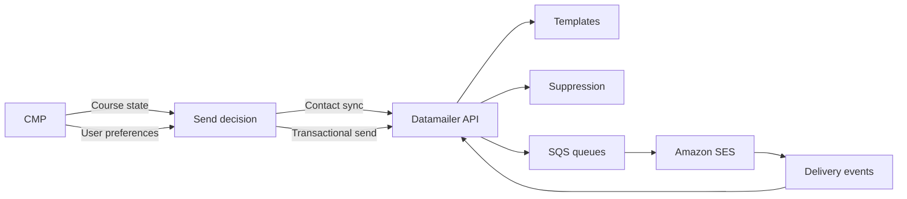
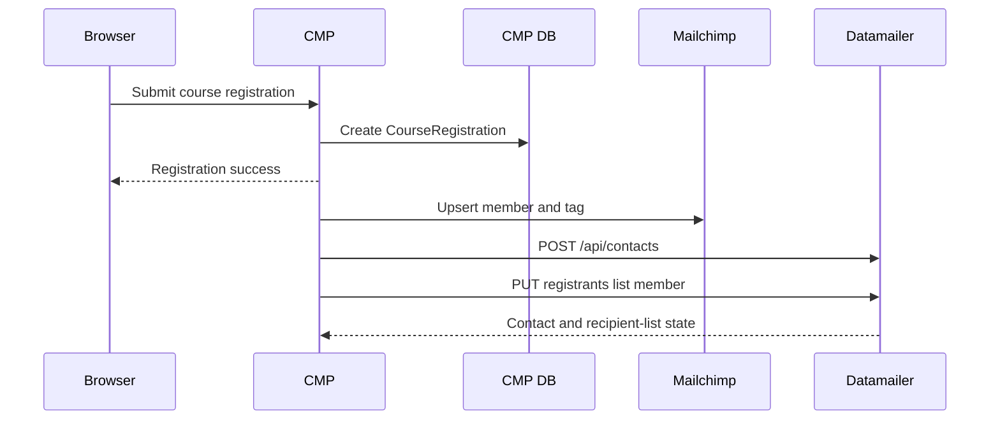
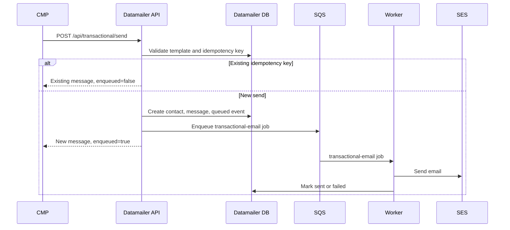
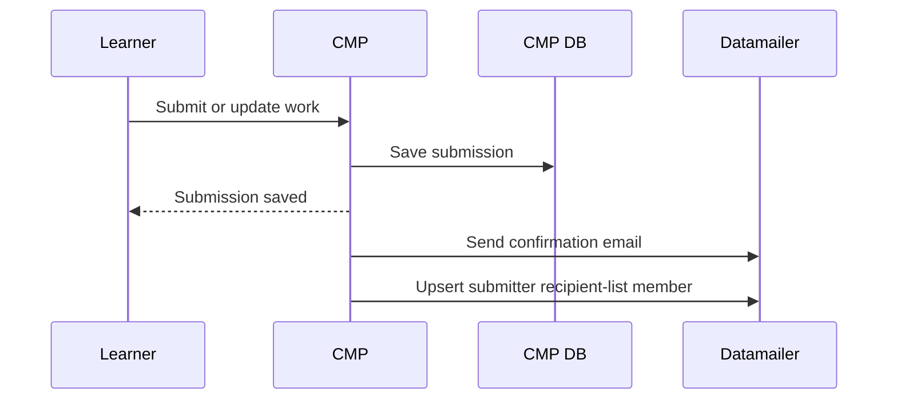
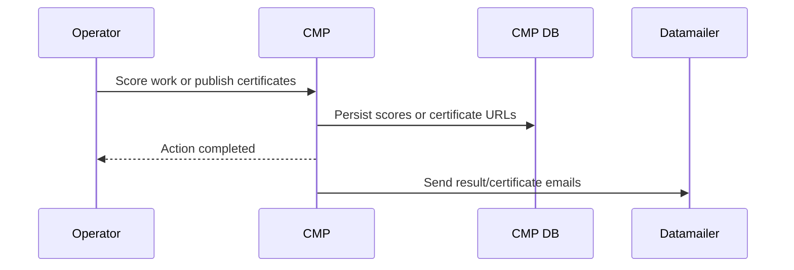
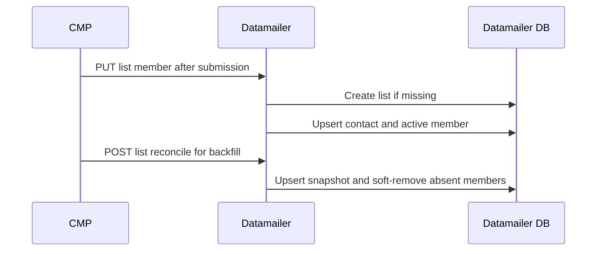
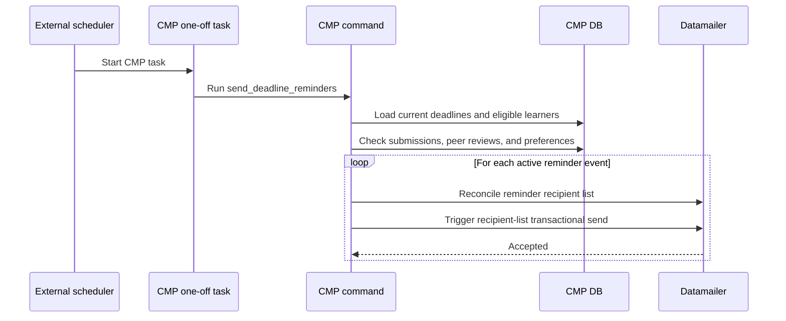
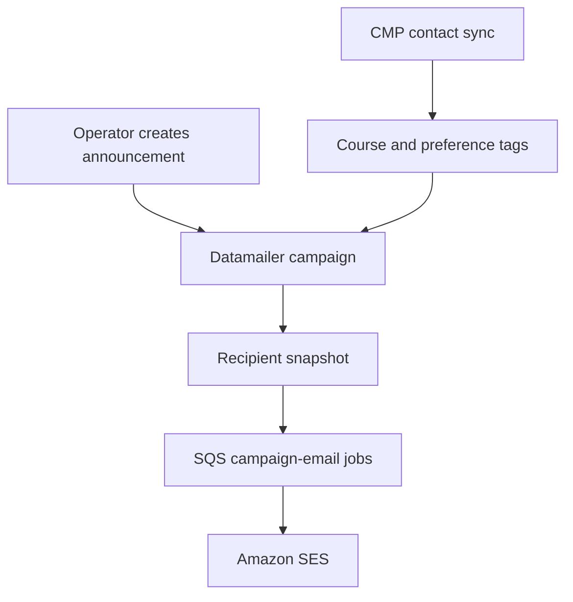
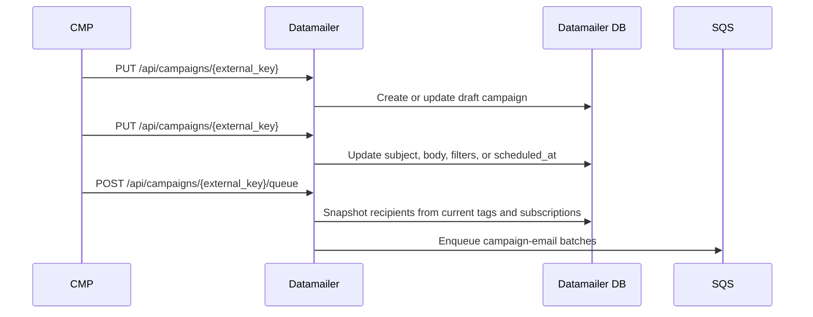

# CMP and Datamailer Protocol

This document defines how the course management platform (CMP) talks to
Datamailer. CMP owns course state and learner preferences. Datamailer owns
email templates, sender configuration, suppression, delivery, event tracking,
and message history.

## Ownership

CMP decides whether a course email should be sent. It has the source data for
users, enrollments, course registrations, submissions, deadlines, scores,
certificates, and account-level notification preferences.

Datamailer decides whether an email can be delivered. It has the source data
for configured senders, transactional templates, contact state, hard bounces,
complaints, unsubscribe state, SQS queueing, SES delivery, and delivery events.



## Implementation Status

The current CMP integration has:

- Datamailer contact sync for new users and enrollments.
- Datamailer homework submission confirmation emails.
- Datamailer contact status and history lookups.
- Parallel Datamailer sync for course registrations.
- Datamailer recipient-list member sync for course registrations, homework
  submitters, and project submitters.
- Datamailer recipient-list sends for homework and project score
  notifications.
- Datamailer project submission confirmation emails.
- Datamailer certificate availability emails.
- Datamailer deadline reminder command using recipient-list sends.
- Datamailer callbacks to CMP for hard bounces, complaints, and unsubscribes.
- CMP backfill command for Datamailer recipient lists.
- Mailchimp sync for course registrations.

The following pieces are planned and not implemented yet:

- CMP UI surfacing for stored Datamailer callback events.

## Configuration

CMP enables Datamailer only when all required settings are present:

```text
DATAMAILER_URL
DATAMAILER_API_KEY
DATAMAILER_CLIENT
DATAMAILER_AUDIENCE
```

CMP may also set:

```text
DATAMAILER_FROM_EMAIL
DATAMAILER_STRICT
DATAMAILER_WEBHOOK_TOKEN
DATAMAILER_SYNC_ON_USER_CREATE
```

`DATAMAILER_FROM_EMAIL` is a Datamailer sender ID, not a raw email address.
Datamailer validates it against the authenticated client sender configuration.

CMP keeps transactional template keys as code-level constants. We don't add one
environment variable per template.

`PUBLIC_BASE_URL` is a CMP URL-building setting, not a Datamailer API setting.
CMP uses it when it builds links for email context.

When `DATAMAILER_STRICT=0`, CMP logs Datamailer failures and lets the course
flow continue. When `DATAMAILER_STRICT=1`, CMP raises the Datamailer API
failure to the caller.

## Contact Sync

CMP syncs contacts to Datamailer when it creates users, enrollments, and course
registrations. During rollout, CMP keeps the existing Mailchimp sync and also
upserts the registrant into Datamailer.

CMP calls:

```text
POST /api/contacts
Authorization: Bearer <DATAMAILER_API_KEY>
```

Example payload:

```json
{
  "email": "learner@example.com",
  "audience": "dtc-courses",
  "client": "dtc-courses",
  "status": "subscribed",
  "verified": true,
  "email_validation": {
    "status": "externally_validated"
  },
  "tags": [
    "course-ml-zoomcamp",
    "course-cohort-ml-zoomcamp-2026"
  ]
}
```

CMP sends `status: subscribed`, `verified: true`, and
`email_validation.status: externally_validated` for course-scoped contacts.
Course-scoped tags include both the family tag and cohort tag, for example
`course-ml-zoomcamp` and `course-cohort-ml-zoomcamp-2026`.

The registration form requires newsletter consent, so CMP marks the contact as
verified and externally validated.



## Transactional Sends

CMP uses Datamailer transactional email for several learner-specific events.
They all call the same Datamailer endpoint, but CMP triggers them from
different parts of the course lifecycle.

| Trigger | Emails | CMP owner | Status |
| --- | --- | --- | --- |
| Learner submits work | homework submission confirmation | homework submit view | implemented |
| Learner submits work | project submission confirmation | project submit view | implemented |
| Operator publishes results | homework score publication notification | cadmin homework scoring action | implemented |
| Operator publishes results | project score publication notification | cadmin project scoring action | implemented |
| Operator publishes certificates | certificate availability notification | certificate bulk update/API flow | implemented |
| Scheduled command runs | deadline reminders | `send_deadline_reminders` management command | implemented |

CMP calls:

```text
POST /api/transactional/send
Authorization: Bearer <DATAMAILER_API_KEY>
```

Example payload:

```json
{
  "email": "learner@example.com",
  "template_key": "homework-submission-confirmation",
  "from_email": "courses",
  "idempotency_key": "homework-submission:123:2026-06-18T10:00:00+00:00",
  "context": {
    "course_slug": "ml-zoomcamp",
    "course_title": "Machine Learning Zoomcamp",
    "homework_slug": "homework-1",
    "homework_title": "Homework 1",
    "update_url": "https://courses.datatalks.club/course/homework/homework-1",
    "profile_url": "https://courses.datatalks.club/accounts/settings/"
  },
  "metadata": {
    "source": "course-management-platform",
    "event": "homework_submission",
    "course_slug": "ml-zoomcamp",
    "homework_slug": "homework-1",
    "submission_id": 123
  }
}
```

Datamailer validates the template context before it creates a transactional
message. If the same `idempotency_key` is sent again for the same client,
Datamailer returns the existing message and does not enqueue another email.



## Submit-Time Emails

CMP sends submit-time confirmations immediately after a learner submits or
updates work. These sends happen after the CMP database transaction commits.

Submit-time emails use the learner's submission-confirmation preference:

```text
email_submission_confirmations
```

CMP sends:

- homework submission confirmation after homework submit or update
- project submission confirmation after project submit or update

These emails include a copy of what CMP saved and a link to update the
submission while the form is open.



## Operator-Time Emails

CMP sends operator-time emails when a staff action makes new information
available to learners.

Score publication emails run after a successful cadmin scoring action:

- homework score notification after an operator scores homework
- project score notification after an operator scores a project

Certificate availability emails run after an operator or API call publishes a
certificate URL for an enrollment. CMP should send this email only when the
certificate URL changes from empty to non-empty.



Score publication is currently implemented as one Datamailer recipient-list
send to the matching submitter list:

```text
POST /api/recipient-lists/homework-submitters:{course_slug}:{homework_slug}/transactional-send
POST /api/recipient-lists/project-submitters:{course_slug}:{project_slug}/transactional-send
```

Datamailer expands CMP's base idempotency key per list member, creates normal
transactional messages, and enqueues the provider work through the
transactional SQS path.

Score publication emails have an important constraint. If the email only says
"results are available", Datamailer can send to a stored recipient list without
per-learner score context. If the email includes each learner's score, CMP must
provide that score context. CMP can do that in one of two ways:

- Send a bulk request with all recipient contexts after scoring.
- Let Datamailer trigger the send and have Datamailer workers fetch score
  context from a CMP callback in chunks.

CMP remains the source of truth for scores either way.

## Recipient Lists

Datamailer has native recipient lists rather than using tags as lists. Tags are
audience-scoped and broad; recipient lists have client and audience scope,
membership audit, backfill support, and send-specific counters.

List keys do not need a `cmp:` prefix because the authenticated Datamailer API
client already scopes ownership.

Recommended list keys:

```text
registrants:{course_slug}
course-enrolled:{course_slug}
homework-submitters:{course_slug}:{homework_slug}
project-submitters:{course_slug}:{project_slug}
peer-review-pending:{course_slug}:{project_slug}
certificate-eligible:{course_slug}
course-graduates:{course_slug}
```

Current Datamailer tables:

```text
recipient_lists
- client
- audience
- key
- type
- name
- metadata
- member_count
- active_member_count
- last_reconciled_at
- created_at
- updated_at

recipient_list_members
- recipient_list
- contact
- email
- source_object_key
- metadata
- active
- removed_at
- created_at
- updated_at
```

Required uniqueness:

```text
(client, audience, key)
(recipient_list, source_object_key)
(recipient_list, contact)
```

CMP maintains registration, homework submitter, and project submitter lists
after local commits. The first member upsert creates the parent list if it does
not exist, so CMP never has to check before adding a member.

```text
PUT /api/recipient-lists/{key}/members/{source_object_key}
```

Example first homework submit:

```text
PUT /api/recipient-lists/homework-submitters:ml-zoomcamp-2026:homework-1/members/homework-submission:123
```

```json
{
  "audience": "dtc-courses",
  "client": "dtc-courses",
  "list": {
    "type": "homework_submitters",
    "name": "ML Zoomcamp 2026 Homework 1 submitters",
    "metadata": {
      "course_slug": "ml-zoomcamp-2026",
      "homework_slug": "homework-1"
    }
  },
  "member": {
    "email": "learner@example.com",
    "status": "active",
    "metadata": {
      "submission_id": 123,
      "user_id": 55,
      "submitted_at": "2026-06-18T12:00:00Z"
    }
  }
}
```

Datamailer supports both event updates and retroactive backfills:

```text
PUT  /api/recipient-lists/{key}
PUT  /api/recipient-lists/{key}/members/{source_object_key}
POST /api/recipient-lists/{key}/members/bulk-upsert
POST /api/recipient-lists/{key}/members/reconcile
GET  /api/recipient-lists/{key}
```

The `members/reconcile` endpoint accepts a full CMP snapshot and can
soft-remove members missing from that snapshot. It supports `dry_run` and
`remove_absent`.



CMP exposes this management command for retroactive list creation:

```console
$ uv run python manage.py sync_datamailer_recipient_lists registrations --course-slug ml-zoomcamp-2026
$ uv run python manage.py sync_datamailer_recipient_lists homework --course-slug ml-zoomcamp-2026 --homework-slug homework-1
$ uv run python manage.py sync_datamailer_recipient_lists project --course-slug ml-zoomcamp-2026 --project-slug midterm-project
$ uv run python manage.py sync_datamailer_recipient_lists homework --course-slug ml-zoomcamp-2026 --reconcile
$ uv run python manage.py sync_datamailer_recipient_lists registrations --dry-run
```

Before an operator triggers score emails from a list, CMP should be able to
read Datamailer list counts and the last reconciliation result. If counts do
not match CMP's source query, CMP should block the email trigger or show an
explicit operator warning.

## Idempotency Keys

CMP must send stable idempotency keys for every transactional email. The key
must identify the event, not the command run.

Recommended keys:

```text
homework-submission:{submission_id}:{submitted_at_iso}
project-submission:{submission_id}:{submitted_at_iso}
homework-score:{homework_id}:{submission_id}
project-score:{project_id}:{submission_id}
certificate-available:{enrollment_id}
deadline-reminder:homework:{homework_id}:24h
deadline-reminder:project:{project_id}:7d
deadline-reminder:project:{project_id}:24h
deadline-reminder:peer-review:{project_id}:24h
```

Deadline reminders use recipient-list transactional sends. CMP sends the base
event key above and Datamailer appends the recipient-list member
`source_object_key`, such as `enrollment:{enrollment_id}` or
`project-submission:{submission_id}`, when creating each learner's
transactional idempotency key.

Deadline reminder keys should not include the command timestamp. The command
can run repeatedly without sending duplicates.

If we decide that a moved deadline should allow a second reminder, CMP can add
the deadline timestamp to the key:

```text
deadline-reminder:homework:{homework_id}:24h:{deadline_iso}
```

We should make that change deliberately because it can send a second reminder
after each deadline edit.

## Deadline Reminders

CMP owns deadline reminder scheduling. Datamailer should not create campaigns
for deadline reminders because Datamailer does not know whether a learner is
enrolled, has submitted, has unfinished peer reviews, or opted out of deadline
reminders.

The command is:

```console
$ uv run python manage.py send_deadline_reminders
```

In production, EventBridge should run a one-off ECS task with the CMP image.
The scheduler should not scan CMP tables or wait for email delivery. The CMP
command reconciles current Datamailer recipient lists for each active reminder,
triggers one recipient-list transactional send per reminder event, then exits.
Datamailer handles the slower per-recipient email work through SQS and workers.



Changing a homework or project deadline does not require CMP to update a
Datamailer campaign. The next scheduled command run reads the current CMP
deadline and computes eligibility from current state.

## Broad Course Emails

Broad course or workshop announcements should use Datamailer campaigns, not a
CMP loop over transactional sends. Campaigns give Datamailer a recipient
snapshot, delivery audit, unsubscribe handling, and operator-visible campaign
history.

CMP should sync contact tags for coarse filtering:

```text
course-{course_slug}
course-cohort-{course_cohort_slug}
pref-submission-confirmations
pref-deadline-reminders
pref-course-updates
pref-results-notifications
```

CMP should not use tags as the canonical source for submitter or registrant
lists. Use recipient lists for those groups.

Datamailer currently supports campaign creation and queueing through the
operator UI. If CMP needs to create or update scheduled campaigns directly, we
should add a Datamailer campaign API with an external key.



## Future Campaign API

If CMP later creates Datamailer campaigns, the protocol should use an external
key so CMP can update a draft or scheduled campaign without creating
duplicates.

Proposed API shape:

```text
PUT /api/campaigns/{external_key}
POST /api/campaigns/{external_key}/queue
POST /api/campaigns/{external_key}/cancel
```

The `PUT` request should update only draft or scheduled campaigns. It should
reject campaigns that are already queued, sending, or sent. Datamailer should
snapshot recipients only when the campaign is queued, not when CMP creates the
draft. That keeps preference and tag changes current until send time.



## Status Lookups

CMP can read contact status and email history for support and debugging.

```text
GET /api/contacts/status?email=<email>&audience=<audience>&client=<client>
GET /api/contacts/{contact_id}/history?audience=<audience>&client=<client>
GET /api/transactional/messages/{message_id}
```

CMP should not use status lookups to decide routine transactional sends.
Datamailer already applies hard bounce and complaint suppression when CMP calls
the send endpoint.

## Datamailer Callbacks

Datamailer calls CMP for contact events that CMP needs to show in its own UI or
map back to CMP preferences.

```text
POST /api/datamailer/events
Authorization: Bearer <DATAMAILER_WEBHOOK_TOKEN>
```

CMP stores each callback in `data_datamailercontactevent` using Datamailer's
stable `event_id`, so repeated callbacks are idempotent.

Implemented event types:

```text
contact.hard_bounced
contact.complained
subscription.unsubscribed
```

Hard bounces and complaints are deliverability state, not user preference
changes. CMP can store them for support and debugging. For unsubscribe events,
CMP should update a CMP preference only when Datamailer sends enough metadata
to map the unsubscribe to a CMP preference category. The implemented webhook
accepts these `preference_key` values:

```text
email_submission_confirmations
email_deadline_reminders
email_course_updates
```

Datamailer callback payload:

```json
{
  "event_id": "datamailer-email-event:123",
  "event_type": "subscription.unsubscribed",
  "email": "learner@example.com",
  "occurred_at": "2026-06-18T10:00:00Z",
  "audience": "dtc-courses",
  "client": "dtc-courses",
  "preference_key": "email_course_updates",
  "metadata": {
    "scope": "client"
  }
}
```

## Failure Handling

CMP should make all Datamailer calls after local database commits where
possible. That avoids sending or syncing email for rolled-back course changes.

When Datamailer is unconfigured, CMP skips Datamailer work. When Datamailer
returns an error:

- With `DATAMAILER_STRICT=0`, CMP logs the error and keeps the learner-facing
  course flow successful.
- With `DATAMAILER_STRICT=1`, CMP raises the error so tests, local checks, or
  strict environments can fail fast.

Datamailer should return existing messages for duplicate idempotency keys.
CMP can safely retry failed HTTP requests when it uses the same key.

List membership maintenance is stricter than best-effort confirmation emails.
If a submit-time list update fails, CMP needs a retry path or a reconciliation
command. The Datamailer list send path should expose counts and reconciliation
state so CMP can detect drift before it triggers score emails.
